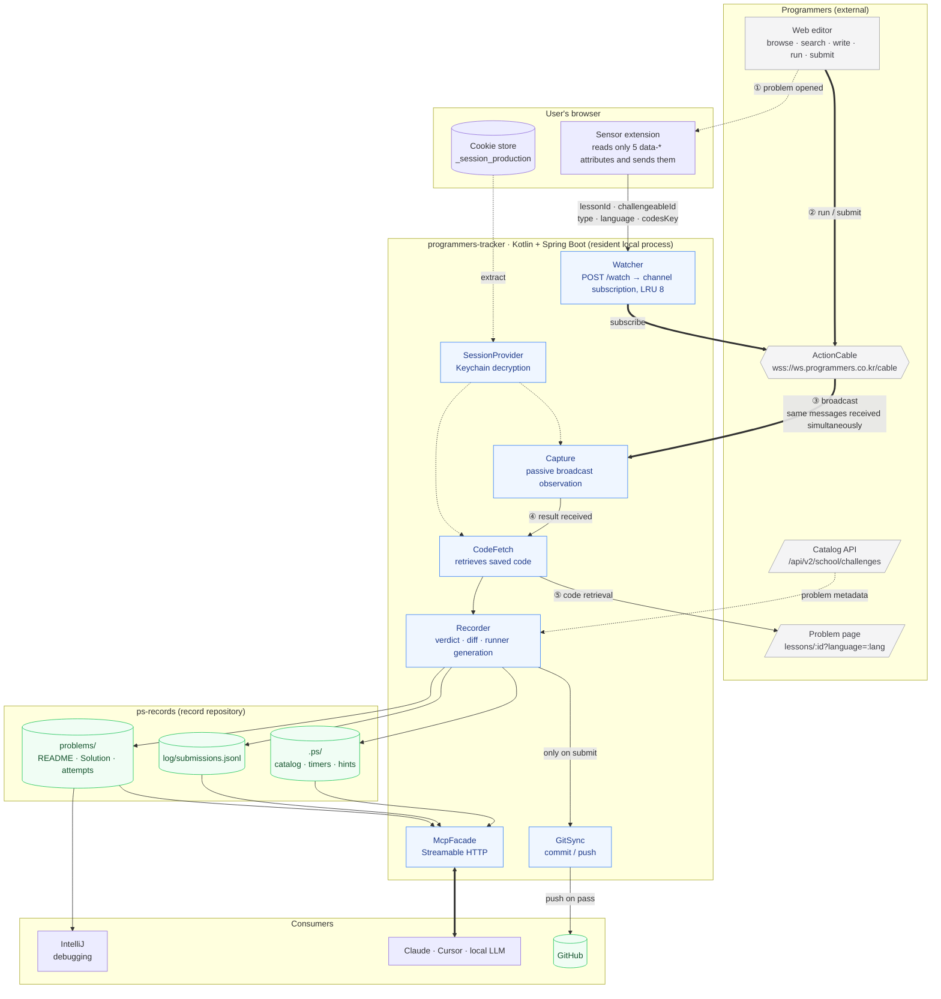
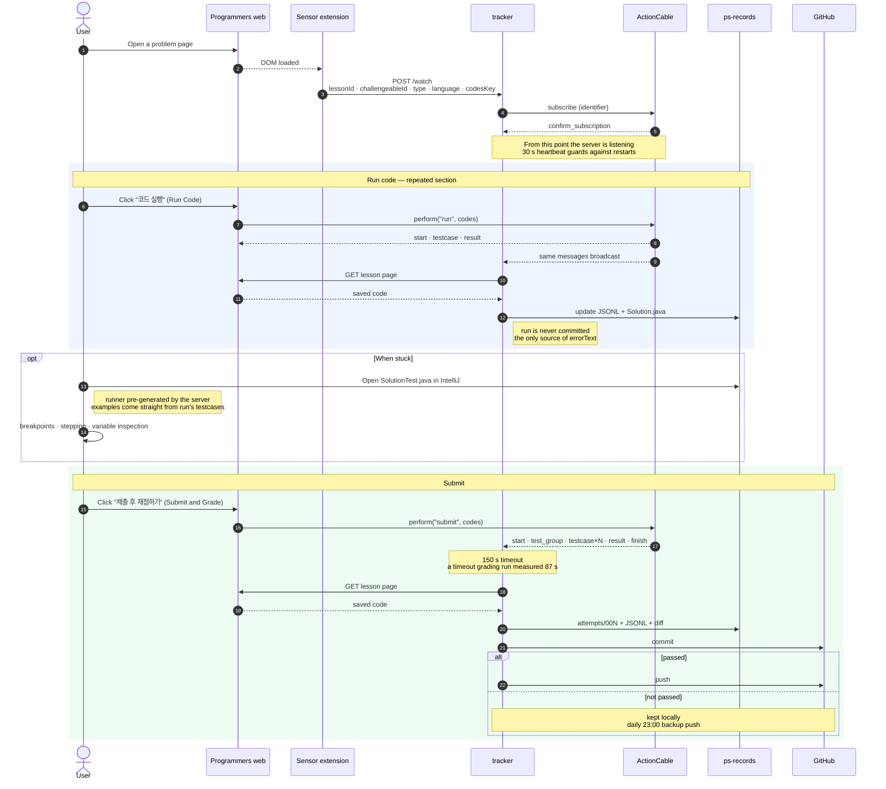
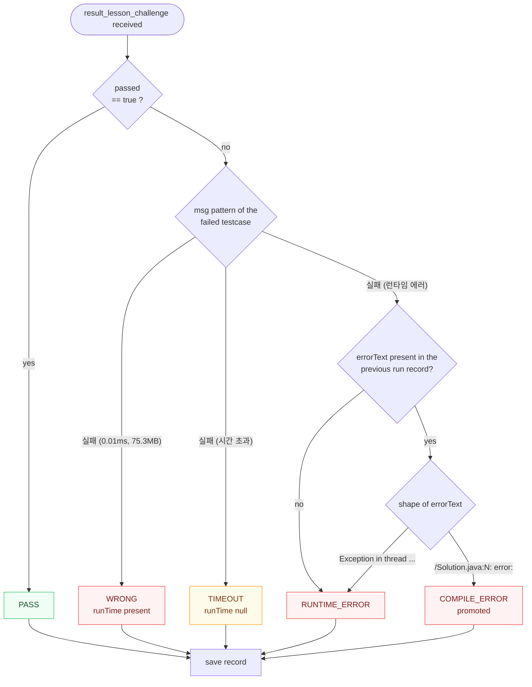

# programmers-tracker Design

Written: 2026-08-04
Status: awaiting design finalization

## 1. Purpose

Record the Programmers solving process **completely, at submission granularity**, and expose
that data over MCP so any AI can provide weakness diagnosis, problem recommendations, and
staged hints.

### Why this is needed

Programmers streams grading results in the moment and then discards them. There is no API to
look up past submissions ([protocol doc](../../programmers-protocol.md) §11). All that
remains is "solved / not solved" and the attempt count per day.

The actual 2025 record reads `attemptTotalCount: 449`, `solvedChallengeCount: 43`.
**Of 449 attempts we can only see the 43 successes; why the other 406 failed is already lost.**

BaekjoonHub also only works on correct answers (`getSolvedResult().includes('정답')`).
It is structurally incapable of recording failure. Once this project is complete, BaekjoonHub
gets removed.

### The judgment that shapes the design

**No analysis logic goes into the server.** The server only collects and aggregates; the
interpretation of "why it was wrong" is done by an AI reading the original code and the diffs
between attempts.

A rule-based analyzer ("3+ timeouts means a time-complexity problem") hits its ceiling fast.
By contrast, when an AI reads the diff between the 1st and 2nd submission it can catch
patterns like "repeatedly misses boundary conditions". The server's mission is to
**leave everything behind, completely, in a form an AI can read.**

## 2. User workflow

The user lives **entirely on the Programmers website.** The server never intervenes.

```
1. Pick and read a problem on Programmers          ← Programmers already does browse/search well
2. Write code in the web editor                    ← no autocomplete = same as the real exam environment
3. Press "코드 실행" (Run Code)                     → the server records the result + code locally
4. When stuck, open the local file in IntelliJ     ← the server has already generated a runner
5. Press "제출 후 채점하기" (Submit and Grade)       → the server records + commits
6. On pass, the server pushes to GitHub
7. Ask an AI "what are my weaknesses?"             → it accesses the data over MCP
```

The server sends **nothing** to Programmers. It subscribes to the same channel and only listens.

## 3. Architecture

### 3.1 System layout



**The bold arrows are the main path of the grading data.** The server sends nothing to
Programmers — it subscribes and listens, and fetches the code from the page.

### 3.2 Capture sequence



### 3.3 Verdict classification

The `submit` response alone cannot distinguish a compile error from a runtime error. The key
is consulting the immediately preceding `run` record and promoting the verdict.



`errorText` is only obtainable via the `run` path and arrives HTML-escaped
(`<br/>`, `&quot;`, `&#39;`). Unescape it first, then classify by shape.

### Why passive observation

ActionCable streams are **scoped by channel parameters**, not by connection. Every client
subscribed to the same `identifier` receives identical messages. We verified empirically that
a separate process, connecting with nothing but the session cookie, received all 4 result
messages fired by the browser as-is (protocol doc §10).

Therefore no MITM proxy and no traffic interception by the extension is needed.

### Why a sensor is needed

The `identifier` must match character-for-character and has no wildcards. There is no way to
subscribe to "all submissions of this user", so the server **must know in advance which
problem the user has opened.** With 689 problems × 13 languages, subscribing to everything is
unrealistic.

## 4. Components

### 4.1 Watcher

Receives `POST /watch` and opens a subscription for that channel.

```jsonc
{ "lessonId": 120804, "challengeableId": 14643,
  "challengeableType": "algorithm", "language": "java", "codesKey": "49598" }
```

- The channel is chosen by `challengeableType`: `algorithm` → `Challenge::AlgorithmChannel`,
  `database` → `Challenge::DatabaseChannel`
- Concurrent subscriptions are capped at **LRU 8**. Beyond that, the oldest is closed first.
- The extension sends a heartbeat every 30 seconds, so subscriptions recover automatically
  after a server restart.
- Switching the language tab changes `codesKey`, so the extension re-sends.

### 4.2 Capture

Connects over WebSocket to `wss://ws.programmers.co.kr:443/cable` and holds the subscriptions.

- Subprotocol `actioncable-v1-json`
- Headers: `Cookie: _session_production=…`, `Origin: https://school.programmers.co.kr`
- `{"type":"ping"}` is ignored
- **Termination condition: receiving `finish` OR `result_lesson_challenge`.**
  SQL never sends `finish`, so waiting only for `finish` hangs forever.
- **150-second timeout.** A timeout-verdict grading run measured 87 seconds. Capping at 60
  seconds would cut off a legitimate timeout verdict mid-grade.
- `testcase` messages arrive out of order due to parallel grading. Sort by `testcaseId`
  before saving.
- Field naming is camelCase for algorithm (`testcaseId`) and snake_case for SQL
  (`testcase_id`). The parser accepts both.

### 4.3 Session cookie

`_session_production` is HttpOnly and unreadable from JS. The server reads it
**directly from the browser's cookie store.**

- macOS: Chrome `Cookies` SQLite + Keychain decryption
- A one-time Keychain access permission prompt appears on first use
- On detecting expiry (`reject_subscription` on subscribe), re-extract; if that fails, log a
  message telling the user to log in again
- The cookie value lives only in memory — never written to disk or logs

### 4.4 CodeFetch

The broadcast carries no source code. Immediately after receiving a result, fetch the problem
page and pull out the saved code.

```
GET /learn/courses/30/lessons/{lessonId}?language={lang}   (auth required)
  → <input data-type="code" value="<my saved code>">
```

> **Unverified assumption**: we measured that code is saved on `submit`, but did not confirm
> whether it is also saved on `run`. If it is not, a `run` capture would pick up the previous
> code. Verify in implementation step 1; if it fails, fall back to **the extension sending
> the CodeMirror value along** (requires MAIN-world injection).

### 4.5 Recorder

Verdict classification rules (protocol doc §7):

| verdict | rule |
|---|---|
| `PASS` | `result.passed == true` |
| `WRONG` | failed + `msg` contains a runtime (`실패 (0.01ms, 75.3MB)`) |
| `TIMEOUT` | `msg == "실패 (시간 초과)"` |
| `RUNTIME_ERROR` | `msg == "실패 (런타임 에러)"` |
| `COMPILE_ERROR` | same as above, but **promoted when the preceding `run` returned a full compile-error text** |

The `submit` response alone cannot distinguish a compile error from a runtime error — both
arrive as `"실패 (런타임 에러)"`. Only the `run` path yields the actual error text, and
`msg` is HTML-escaped, so it needs unescaping plus `<br/>` → `\n` replacement.

### 4.6 GitSync

- **1 `submit` = 1 commit.** Wrong-answer commits pile up as-is — that *is* the learning
  record. `run` is never committed (it only lands in the JSONL).
- **Push timing: when the problem passes.** The whole attempt history of a problem goes up
  at once.
- **Backup trigger**: problems never solved are never pushed, so push un-pushed commits
  daily at 23:00 (Asia/Seoul), plus allow manual runs via MCP `push()`.

Commit message format:

```
[Lv2] 소수 찾기 — WRONG (12/16, attempt 3)
[Lv2] 소수 찾기 — PASS (16/16, attempt 4, 24m18s)
```

Verdict and attempt count stay readable from `git log` alone.

## 5. Data model

### 5.1 Directory layout

```
ps-records/
├── problems/
│   └── 120804-두-수의-곱-구하기/
│       ├── README.md            problem statement + examples
│       ├── Solution.java        latest code (updated on every run/submit)
│       ├── SolutionTest.java    server-generated runner — for IntelliJ debugging
│       ├── meta.json            identifiers · level · partTitle · acceptanceRate
│       └── attempts/
│           ├── 001.java  001.json
│           ├── 002.java  002.json
│           └── 003.java  003.json
├── log/
│   └── submissions.jsonl        every submission, one line each
└── .ps/
    ├── catalog.json             cached catalog of 689 problems
    ├── timers.json              per-problem start times
    └── hints.json               per-problem hint unlock level
```

`attempts/` is the heart of this design. **The diff between 001 → 002 is precisely "what
was missed".**

### How run and submit are handled differently

Both are recorded, but **treated differently.** `run` gets pressed dozens of times while
writing code; treating it like `submit` would meaninglessly inflate commits and attempt
numbers.

| | `run` | `submit` |
|---|---|---|
| recorded in `log/submissions.jsonl` | ✅ | ✅ |
| `Solution.java` updated | ✅ | ✅ |
| `attempts/NNN.*` files created | ✗ | ✅ |
| `attempt` number incremented | ✗ (keeps the previous submit's number) | ✅ |
| git commit | ✗ | ✅ |
| `diffFromPrev` computed | ✗ | ✅ (vs. the previous submit) |

`run` is **the only source of the full error text (`errorText`)**, so it must be recorded.
When `submit` gives only `"실패 (런타임 에러)"`, the compiler output or stack trace survives
in the immediately preceding `run` record. That record is also what the Recorder uses for
the `COMPILE_ERROR` promotion.

The `run` count itself is a metric — **how many times you tried before submitting** shows
carefulness and trial-and-error patterns.

The reference point for `elapsedSec` is **the time the extension first reported the problem**
(`.ps/timers.json`). Re-opening the same problem later does not restart the timer; it
accumulates.

The testcases for `SolutionTest.java` come straight from the `testcases: [{input, output}]`
payload carried in the `run` message's `start`. No need to parse the problem-statement HTML.

### 5.2 Submission record

```jsonc
{
  "ts": "2026-08-04T14:23:01+09:00",
  "lessonId": 120804, "title": "두 수의 곱 구하기",
  "level": 0, "part": "코딩테스트 입문", "acceptanceRate": 91,
  "tags": ["구현"],                      // copied from meta.json · [] if untagged
  "language": "java",
  "action": "submit",                    // submit | run
  "attempt": 2,
  "elapsedSec": 847,                     // since the problem was first observed
  "sincePrevSec": 312,                   // since the previous submission
  "hintLevel": 0,                        // 0 = none seen, 1–4

  "verdict": "TIMEOUT",
  "score": {"user": "0.0", "perfect": "100.0"},
  "testcases": [
    {"id": 154911, "passed": false, "msg": "실패 (시간 초과)",
     "runTime": null, "memorySize": null}
  ],
  "tcSummary": {"total": 16, "passed": 0, "failed": 16},
  "rating": {"old": 1372, "new": 1372, "changed": false},

  "codePath": "problems/120804-…/attempts/002.java",
  "diffFromPrev": "@@ -3,1 +3,1 @@\n-        return num1 * num2;\n+        long r = 0; …",
  "errorText": null                      // full compiler/stack-trace text obtained from run
}
```

### 5.3 Problem-type tags — AI tagging

**Programmers does not publish per-problem algorithm tags.** The problem page has no tag
markup, and the breadcrumb is just the same value as `partTitle`. Decomposing the
`partTitle` of all 689 problems:

| nature | count | examples |
|---|---:|---|
| contest · course bundles | 422 (61%) | `2022 KAKAO BLIND RECRUITMENT`, `코딩테스트 입문` |
| `연습문제` — uncategorized | 114 (17%) | — |
| SQL topics | 106 (15%) | `SELECT`, `GROUP BY`, `JOIN` |
| **algorithm type** | **47 (7%)** | `해시`, `DFS/BFS`, `탐욕법`, `힙` |

Only the 47 high-score Kit problems carry an algorithm type. Analyzing weaknesses by
`partTitle` alone means **for 93% of problems there is no answer to "which algorithm am I
weak at".**

Internally a `categories` scheme does exist: `/api/v1/ai/recommended-challenges/recommend`
responses carry `"categories":["자료구조"]`. But that API returns a single recommendation
and repeats the same value on repeated calls, so full collection is impossible.

#### Solution — AI tags, server caches

The server already stores the problem statements. An AI reads each once, classifies it, and
the result goes into `meta.json` for permanent reuse. Exactly the "server collects, AI
interprets" principle.

```jsonc
// problems/49189-가장-먼-노드/meta.json
{
  "lessonId": 49189, "challengeableId": 813, "codesKey": {"java": 2458},
  "level": 3, "part": "고득점 Kit", "acceptanceRate": 51,
  "tags": ["그래프", "BFS"],          // AI-tagged
  "taggedBy": "claude-opus-5", "taggedAt": "2026-08-04T15:02:11+09:00",
  "pgCategories": ["자료구조"]        // kept alongside when Programmers happens to leak a value
}
```

#### The tag vocabulary is solved.ac's

We do not invent our own tag scheme. **The 180 solved.ac tags are adopted as the
vocabulary.**

```
세그먼트 트리 · 느리게 갱신되는 세그먼트 트리 · 최소 공통 조상 · 트라이 · 위상 정렬
분할 정복 · 분리 집합 · 배낭 문제 · 매개 변수 탐색 · 조합론 · 누적 합 · 비트마스킹
최소 스패닝 트리 · 강한 연결 요소 · 값/좌표 압축 · 오프라인 쿼리 · 스위핑 …
```

Reasons for adoption:

- **Complete.** A hand-rolled list of 17 was missing KMP, LIS, Fenwick tree, topological
  sort, and combinatorics entirely.
- **Hierarchical.** Parent/child relations like `그래프 이론 > 그래프 탐색 > 너비 우선 탐색`
  are in place, so the aggregation granularity can be chosen freely.
- **Korean-native**, matching the vocabulary of Korean coding-test literature.
- **Zero maintenance burden.**

> Baekjoon Online Judge shut down in May 2026. However, **the solved.ac API is still alive
> and keeps serving the tag vocabulary and hierarchy** (measured 2026-08-04: tag list of
> 180, problem lookup normal). What we need is a classification vocabulary, not a judge, so
> the shutdown does not affect us. Still, it is an external dependency, so **the vocabulary
> is pinned as a snapshot in `.ps/tag-vocab.json`** so tagging and aggregation keep working
> even if solved.ac disappears.

```
GET https://solved.ac/api/v3/tag/list?page=N        full vocabulary (180 tags)
```

The Cloudflare challenge blocks the server's plain HTTP client. Vocabulary collection is
done **once in a browser context** to produce the snapshot; afterwards only the local file
is read.

Multiple tags per problem are allowed. Untagged problems keep `tags: []`, and `stats`
aggregation counts them separately as "untagged" — nothing is silently dropped.

Feedback flows in through the MCP tool `tag_problem(lessonId, tags[])`.

### 5.4 Capturing Programmers' own metrics

Programmers also runs its own skill report. We keep it alongside as a cross-check for our
analysis.

```
GET /api/v1/school/challenges/users/       {rank, score, solvedChallengesCount}
GET /api/v2/ai/skill-reports/status        {lastReport, submissionsCount, reportCreatable}
```

Snapshot once a day into `.ps/pg-metrics.jsonl`. The rating/ranking time series becomes a
control group independent of our records.

### 5.5 Obsidian viewing layer

`ps-records` is built to **open directly as an Obsidian vault.** No separate GUI is
developed.

**Rationale**: half of our data is already Markdown. With Obsidian plus the Dataview plugin,
tables, filters, sorting, and aggregation all come for free. A homegrown dashboard would be
one more thing to maintain.

#### Separating source from derived

The JSONL is the **source of truth**; the Markdown is **derived**. The server generates the
Markdown from the JSONL. To keep the duplication from drifting, the split must be by
**who writes the file.**

```
problems/120804-두-수의-곱-구하기/
├── README.md         ← server-generated. Overwritten every time; human edits vanish on the next record
├── notes.md          ← retrospective notes. AI/humans append; the server never touches it
├── Solution.java
├── SolutionTest.java
├── meta.json
└── attempts/
```

**Server-written files and human-written files are never mixed in one file.** Splitting a
file into marker-delimited regions eventually breaks.

#### README.md frontmatter

Structured so Dataview can read it.

```markdown
---
lessonId: 120804
title: 두 수의 곱 구하기
level: 0
part: 코딩테스트 입문
acceptanceRate: 91
tags: [구현]
language: java
verdict: PASS
attempts: 2
runCount: 7
elapsedSec: 847
firstSeen: 2026-08-04
lastSubmit: 2026-08-04
confidence: 0.82
nextReview: 2026-10-03
---

# 두 수의 곱 구하기

#프로그래머스 #Lv0 #구현

## Attempt history
| # | Time | verdict | Score | Elapsed |
|---|---|---|---|---|
| 1 | 14:09 | WRONG | 1.4 | 8m12s |
| 2 | 14:23 | PASS | 100.0 | 14m07s |

## Problem
…
```

Tags are also exposed **as Obsidian tags (`#구현`)**. Type clusters become visible in the
graph view, and `[[…]]` links connect problems sharing a tag.

#### Server-generated dashboard notes

The vault root gets notes containing Dataview queries. Since what is generated is the
**query**, not the data, the notes never need updating as records grow.

````markdown
<!-- _weakness.md -->
## First-submission pass rate by tag
```dataview
TABLE length(rows) AS Problems,
      round(100 * length(filter(rows.attempts, (a) => a = 1)) / length(rows)) AS "First-try pass rate (%)"
FROM "problems"
GROUP BY tags
SORT Problems DESC
```

## Passed but slow
```dataview
TABLE level, tags, maxRunTime AS "Max runtime (ms)"
FROM "problems"
WHERE verdict = "PASS" AND slowFlag = true
SORT maxRunTime DESC
```
````

Notes to generate:

| note | contents |
|---|---|
| `_dashboard.md` | recent submissions · problems in progress · today's stats |
| `_weakness.md` | pass rate by tag · verdict distribution |
| `_review.md` | review queue (sorted by `nextReview`) |
| `_warmup.md` | reactivation diagnosis results — alive / fuzzy / dead |
| `_exam.md` | past-exam set progress |

#### Which repository holds what

**The Obsidian vault is `ps-records`.** The folder the user opens is the record repository.

| | `programmers-tracker` (public) | `ps-records` (personal) |
|---|---|---|
| Markdown generation logic | ✅ `adapter/store` | — |
| Dataview query templates | ✅ bundled as resources | — |
| generated `README.md` · dashboard notes | — | ✅ |
| `.obsidian/` settings | — | ✅ |
| **what gets opened in Obsidian** | — | ✅ |

The server is the *producer* side; `ps-records` is the *viewer* side. Query templates are
bundled into the server, and the server writes the notes into the `ps-records` root — the
user never has to build the Obsidian setup by hand.

`ps-records/.obsidian/` is committed too. When someone else creates their own `ps-records`,
the server generates the initial configuration. The only required plugin is **Dataview.**

```
ps-records/                    ← open this folder as the Obsidian vault
├── .obsidian/                 server-generated on init (enables Dataview)
├── _dashboard.md              server-generated
├── _weakness.md
├── _review.md
├── _warmup.md
├── _exam.md
├── problems/
└── log/submissions.jsonl      ignored by Obsidian, read over MCP
```

> Obsidian is entirely optional. `README.md` renders as-is on GitHub, and the path AIs read
> over MCP is the JSONL, which is unaffected. **Obsidian is an optional viewing layer, not a
> dependency.**

### 5.6 Questions this data can answer

| question | fields used |
|---|---|
| **How** do I usually die (logic error / timeout / slip-up) | `verdict` distribution |
| **First-submission pass rate** — the metric that matters most in real exams | `attempt == 1 && verdict == PASS` |
| Weakness by type | `tags` × `verdict` (not `part` — see 5.3) |
| Time spent vs. difficulty | `elapsedSec` × `level` |
| Hint-dependence trend | `hintLevel` time series |
| **Recurring mistakes** | AI reads `diffFromPrev` |
| Untouched types | compare against the 689-problem catalog |

The last item is already proven: of the current 91 problems, 46 are SQL, and on the
algorithm side **DFS/BFS, greedy, heap, and graph are entirely empty.**

## 6. Analysis features

The server computes metrics and hands them over; interpretation is the AI's job. Each
feature is exposed as an MCP tool.

Priorities: **P1 = immediately useful even with little data**, **P2 = becomes meaningful
after dozens of records.**

### 6.1 Past-exam set mode (P1)

`partTitle` is useless as a weakness axis but **perfect as a company × period axis.**
Programmers' greatest asset lives here — company exam sets preserved as sets.

```
Kakao                                     98 problems / 15 period sets
Programmers' own contests                 42 problems
PCCP · PCCE certification                 28 problems
Summer/Winter Coding                      15 problems
Hyundai Mobis · Dev-Matching · Tipstown   15 problems
                                          ─────────
                                          198 problems
```

Sets keep their real exam composition:

```
2023 KAKAO BLIND RECRUITMENT   7 problems   levels 1/2/2/3/3/3/4
2022 KAKAO BLIND RECRUITMENT   7 problems   levels 1/2/2/2/3/3/3
2018 KAKAO BLIND RECRUITMENT  12 problems   levels 1/1/2/2/2/2/2/2/2/3/3/4
```

A **set-level timer mode** is provided. Starting a set runs an overall timer while
per-problem time is recorded separately. Real-exam failures often come from **time
allocation** rather than skill, and facts like "spent 90 minutes on #3 and never saw #4
and #5" only surface when solving as a set.

`exam_start(partTitle)` / `exam_status()` / `exam_finish()`

### 6.2 Company question-style profiling (P1)

Aggregating the AI-tagging results by company × period reveals **what each company asks.**
Programmers itself does not provide this, and once target companies are decided it directly
sets the study priorities.

```
Tag distribution over Kakao's 98 problems → top types and year-over-year trend
```

`company_profile(company?)`

### 6.3 Reactivation diagnosis (P0 — first)

**Premise**: the user solved 103 Gold problems in 2024 (priority queue averaging Gold II,
segment tree averaging Gold I) but has since had a long gap and forgotten much of it.

This fact breaks the premise of the review queue. Computing from "last pass date" makes
**every past problem instantly overdue**, producing no priorities. A starting point is
needed.

The knowledge is **deactivated, not lost**, so recovery is far faster than first-time
learning. It is therefore more efficient to **measure how much was forgotten first** than
to solve new problems.

#### Procedure

1. Pick 1–2 representative previously-passed problems per tag (based on
   `.ps/tag-vocab.json`)
2. The server **backs up the existing code**, then resets the Programmers editor
3. The user re-solves without looking at the code — timer running
4. Compare the result against the past record and classify three ways

```
Alive   passed on the 1st try · elapsed time within 1.5× of the past record
Fuzzy   2–3 attempts, or 2×+ elapsed time, or hint level 1–2
Dead    4+ attempts · hint level 3+ · did not pass
```

This map becomes **the actual study priority list.** Pass rate by tag alone cannot separate
"never tried" from "did it but forgot", and those two call for entirely different
prescriptions.

#### Editor reset

Opening a solved problem on Programmers shows the old code, so it cannot simply be
re-solved. The `reset` action restores the initial skeleton.

```js
channel.perform("reset")   →   handleReset { initialCodes }
```

> **Warning**: `reset` erases the code saved on Programmers. Run it only after the server
> has secured a backup under `problems/<problem>/attempts/`. Resetting without a backup
> loses the past solution irrecoverably. It is an unverified action, so implementation must
> confirm it empirically.

`warmup_plan(perTag?)` / `warmup_reset(lessonId)` / `warmup_report()`

### 6.4 Review queue (P1)

"Re-solving old problems" is in substance **spaced repetition**, not similarity search.
Programmers only knows "solved"; we know **how** it was solved.

```
confidence = f(attempt count, hint level, elapsed time, performance vs. expectation)
next review date = last pass date + g(confidence)

  1st try, no hints, 10 min          → high confidence → 60 days later
  5 wrong tries, level-3 hints       → low confidence  → 3 days later
```

All of it is exact computation; no vector search required. `review_queue(limit?)`

### 6.5 Passed-but-slow queue (P1)

`run_time` arrives per testcase. **Passing is not the end.** A pass that is markedly slower
than same-tag/same-level problems signals missing the intended solution.

Existing records already catch it:

| problem | runtime | likely cause |
|---|---:|---|
| 더 맵게 (Lv2) | 1636.97 ms | priority-queue problem, presumably re-sorting every iteration |
| 전화번호 목록 (Lv2) | 371.72 ms | hash problem, presumably sort + compare |

With efficiency tests in a real exam, this is an outright fail. `slow_passes(threshold?)`

### 6.6 Performance vs. expectation (P2)

The catalog's `acceptanceRate` corrects for difficulty. Solving a 91%-acceptance problem in
5 tries and a 4%-acceptance problem in 2 tries are completely different achievements, yet
both are recorded merely as `PASS`.

```
expected attempts ≈ f(acceptanceRate, level)
performance = expected attempts / actual attempts        > 1 means above expectation
```

A far more precise axis than `level` 1–5, and reused as-is for difficulty control in
problem recommendation.

### 6.7 Tracking failed testcase numbers (P2)

Programmers does not disclose testcase contents but **does reveal which numbers failed.**
Tracking the intersection across submissions turns that into information.

```
1st: 3,7,9,12,14 fail   →   2nd: 9,14   →   3rd: 14
```

The number that survives to the end is a specific edge case. Asking an AI "only #14 keeps
failing — what counterexample is this?" makes it inferable. Invisible in a single
submission; only visible once history accumulates.

`stuck_testcases(lessonId)`

### 6.8 Language-choice experiment (P2)

Whether to take the real exam in Java or Kotlin is a genuine decision. Kotlin is shorter
and saves time, but unfamiliarity breeds mistakes. Comparing **first-submission pass rate
and elapsed time per language** within the same level band answers it with data. Only our
records can tell.

`stats(groupBy: "language")`

### 6.9 Auto-generated retrospective notes (P1)

The moment a problem passes, an AI reads the problem's **entire attempt history and diffs**
and appends a one-paragraph summary to `README.md`.

> Missed the `n=1` boundary in attempt 1; attempt 2 timed out, so switched to `HashMap`.
> Passed on attempt 3. Recurring pattern: boundary values not checked first.

Combined with the review queue, **you read your past self before re-solving.**
The server only provides the hook; the AI generates the summary.
`append_retro(lessonId, text)`

### 6.10 Concept prerequisites (P2)

The real cause of "weak at DP" may be the recursion/brute-force that precedes it. A fixed
graph layering learning order onto the solved.ac tag hierarchy lives in
`.ps/concept-graph.json`.

```
완전탐색 → 재귀 → 다이나믹 프로그래밍
정렬 → 이분 탐색 → 매개 변수 탐색
그래프 탐색 → 최단 경로 → 데이크스트라
```

Fixed data with a few dozen nodes — no graph DB needed.

### 6.11 What was rejected — vector DB

At the current scale (689 problems, under 2,000 expected submissions) the full embedding
set is around 4 MB and exact search finishes in milliseconds. There is no reason to
sacrifice accuracy for approximate nearest-neighbor search.

More fundamentally, **coding-test problems deliberately decouple surface narrative from
actual type.** "택배 상자 싣기" and "회의실 배정" read nothing alike yet are both
greedy+sorting; "미로 탈출" and "미로 만들기" read alike yet differ in type. **Statement
embeddings point in exactly the wrong direction.** AI tagging is the more accurate
similarity axis.

All original text (problem statements, code, errors, diffs) is preserved, so an index can
be built later if ever needed. Vectors become genuinely necessary only when merging
external problem banks into tens of thousands of items, or when hundreds of natural-language
retrospectives require semantic search.

## 7. MCP interface

Transport is **Streamable HTTP**. stdio is one-per-process, which does not fit a resident
server. A thin bridge is shipped alongside for stdio-only clients.

```
[Query]
  list_problems(level?, part?, tag?, status?)  catalog of 689 problems
  get_problem(lessonId)                        problem statement + all my attempts
  submissions(since?, verdict?, tag?)          submission history
  attempt_diff(lessonId, from, to)             diff between attempts
  stats(groupBy)                               aggregation by verdict · tag · language

[Reactivation]  ← 6.3 · the first tools to use
  warmup_plan(perTag?)                         pick re-check targets per tag   P0
  warmup_reset(lessonId)                       back up code, then reset editor P0
  warmup_report()                              alive / fuzzy / dead            P0

[Analysis]  ← §6
  review_queue(limit?)                         review queue        6.4  P1
  slow_passes(threshold?)                      passed but slow     6.5  P1
  performance(lessonId?)                       vs. expectation     6.6  P2
  stuck_testcases(lessonId)                    stuck case numbers  6.7  P2
  company_profile(company?)                    company tendencies  6.2  P1

[Exam mode]  ← 6.1
  exam_start(partTitle)                        start the set timer
  exam_status()                                remaining problems · elapsed
  exam_finish()                                results + time-allocation report

[Write]
  tag_problem(lessonId, tags[])                AI tagging feedback  5.3
  untagged(limit?)                             list untagged problems
  append_retro(lessonId, text)                 append retro note    6.9
  mark_hint(lessonId, level)                   record hint unlock
  push()                                       GitHub sync

[Resources]
  ps://problem/{lessonId}
  ps://submissions/recent
  ps://stats/weakness
  ps://exam/current
```

**Every analysis tool returns only numbers and raw data.** The "why" interpretation is done
by the AI.

`stats` emits numbers only. Interpretation is done by an AI reading `attempt_diff` and the
original code.

### Hint unlock rules

Four levels, and **the next level opens only after at least one submission since the
previous level.**

1. Approach direction only
2. Name of the data structure / algorithm to use
3. Pseudocode
4. Full solution

Recorded via `mark_hint`; "how far the hints went" is itself a skill indicator.
The server manages only the level state; hint content is generated by the AI.

## 8. Sensor extension

It has one job — **announce "this problem is being viewed right now."** It touches neither
code nor results, and knows nothing about GitHub.

```js
// content script: school.programmers.co.kr/learn/courses/30/lessons/*
const el = document.querySelector("[data-challengeable-id]");
const input = document.querySelector("input[data-type=code]");

const notify = () => fetch("http://localhost:8080/watch", {
  method: "POST",
  headers: {"Content-Type": "application/json"},
  body: JSON.stringify({
    lessonId:          document.querySelector("[data-lesson-id]").dataset.lessonId,
    challengeableId:   el.dataset.challengeableId,
    challengeableType: el.dataset.challengeableType,
    language:          input.dataset.language,
    codesKey:          input.id,
  }),
});

notify();
setInterval(notify, 30_000);   // heartbeat — survives server restarts
```

Its only permissions are access to `school.programmers.co.kr` pages and localhost requests.

## 9. Edge cases

| situation | handling |
|---|---|
| submitting while the server is down | Missed. On server start, diff the solved list for **partial recovery** (code and failures unrecoverable) |
| running immediately after opening the page | Subscription completes within 1 s. Writing code takes far longer, so no practical risk |
| back-to-back submissions of the same problem | Programmers serves a cached response then emits `error`. The server records the `error` too |
| several problems open at once | up to 8 concurrent subscriptions (LRU) |
| switching the language tab | `codesKey` changes → extension re-notifies |
| cookie expiry | detect `reject_subscription` → re-extract → on failure, tell the user to log in again |
| problems never passed | daily 23:00 backup push + manual `push()` |

## 10. Test strategy

- **Judge/Capture**: integration tests against real Programmers. Reproduce all 5 verdicts
  on Lv0 problems (PASS / WRONG / TIMEOUT / RUNTIME_ERROR / COMPILE_ERROR).
  The verification log in protocol doc §15 is the basis for expected values.
- **Recorder**: pin captured real message streams as fixtures and unit-test.
  Cover both algorithm and SQL formats.
- **GitSync**: unit tests against a temporary repository.
- **MCP**: contract tests per tool.

## 11. Implementation order

1. **Reproduce subscribe/receive with a Kotlin WebSocket client** — the only unverified
   assumption. Confirmed only with Python, so break this first.
2. Cookie extraction (Chrome Cookies SQLite + Keychain)
3. Capture + verdict classification + verifying whether code is saved on `run`
4. Recorder — directories · JSONL · diff · runner generation
5. Watcher + sensor extension
6. GitSync
7. MCP exposure
8. Remove BaekjoonHub

With just 1–4, records already start accumulating. **The order maximizes how early data
accumulation begins.**

## 12. Finalized decisions

| item | decision |
|---|---|
| stack | Kotlin + Spring Boot |
| grading integration | passive observation (ActionCable subscription) |
| where code is written | the Programmers web editor |
| debugging | the user, directly in IntelliJ. **No debugger MCP** |
| hints | 4-level unlock; must submit to open the next level |
| record repository | `ps-records` — personal data, private |
| server source | `programmers-tracker` — to be public |
| commits | 1 per `submit` (`run` is not committed) |
| push | on problem pass + daily 23:00 backup |
| cookie | auto-extracted from the browser store |

### Why no debugger MCP

With the [Debugger MCP Server](https://plugins.jetbrains.com/plugin/29233-debugger-mcp-server)
it is technically possible for an AI to drive breakpoints, stepping, and variable
inspection. But the reason for wanting debugging was "I want to set the breakpoints
myself." If an AI drives the debugger, debugging is outsourced rather than learned, which
**directly contradicts the decision to turn autocomplete off.**

Not an irreversible decision — if needed later, it can be attached as a separate MCP
server.

## 13. Open questions · assumptions

- **Identical behavior in Kotlin** — verified only with Python. Confirm in implementation
  step 1.
- **Whether code is auto-saved on `run`** — unverified. On failure, the extension sends the
  CodeMirror value along.
- The 2-entry `scores` shape for problems with efficiency tests — never triggered
- A memory-limit-exceeded verdict — never triggered
- The exact rules of Programmers' rate limiting — unconfirmed
- Breakage risk on Programmers UI/API changes. Identifier extraction depends on `data-*`
  attributes and is fragile to markup changes. On failure, emit a clear error and never
  silently record wrong data.
