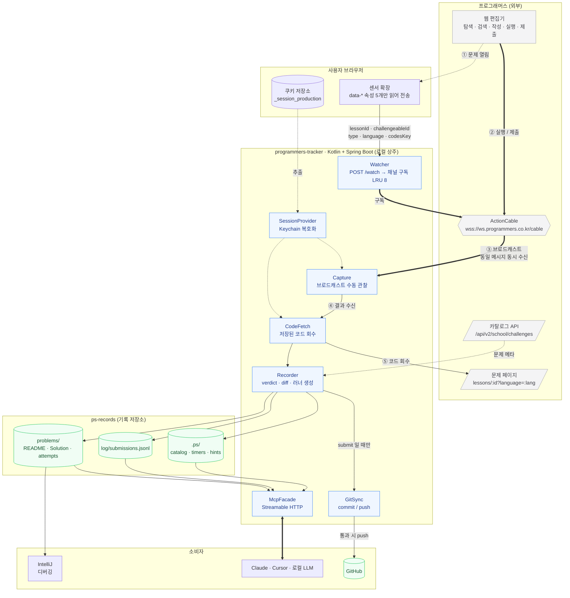
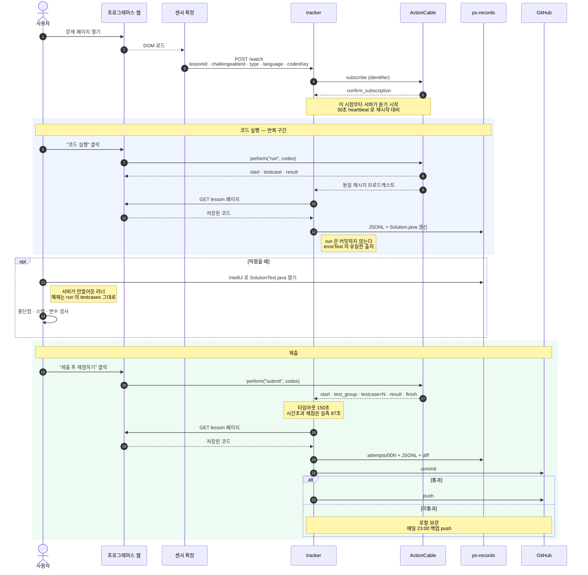
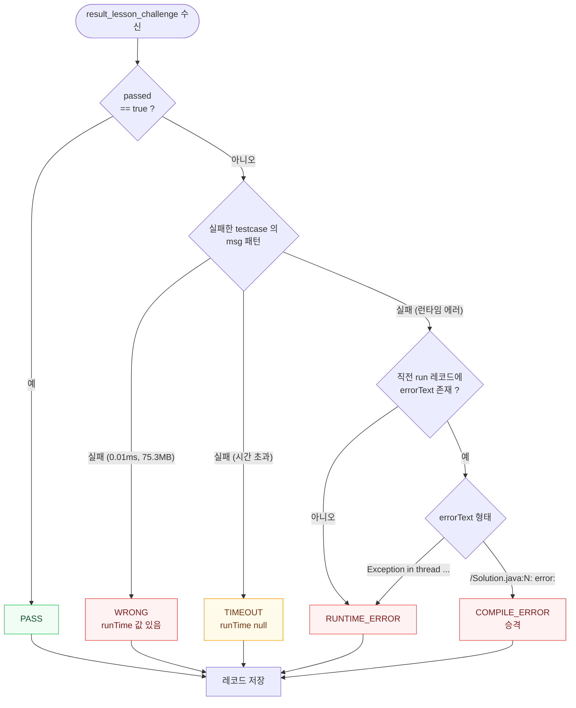

# programmers-tracker 설계

작성일: 2026-08-04
상태: 설계 확정 대기

## 1. 목적

프로그래머스 풀이 과정을 **제출 단위로 빠짐없이 기록**하고, 그 데이터를 MCP로 노출해
어떤 AI로든 약점 진단·문제 추천·단계적 힌트를 받을 수 있게 한다.

### 왜 필요한가

프로그래머스는 채점 결과를 그 순간에 흘려보내고 끝낸다. 지나간 제출을 조회할 API가 없다
([프로토콜 문서](../../programmers-protocol.md) 11절). 남는 것은 "풀었다/못 풀었다"와
날짜별 시도 횟수뿐이다.

실제로 2025년 기록은 `attemptTotalCount: 449`, `solvedChallengeCount: 43`이다.
**449번의 시도 중 43번의 성공만 알 수 있고, 나머지 406번이 왜 실패했는지는 이미 소실됐다.**

BaekjoonHub도 정답일 때만 동작한다(`getSolvedResult().includes('정답')`). 구조적으로
실패를 기록할 수 없다. 이 프로젝트가 완성되면 BaekjoonHub는 제거한다.

### 설계를 가르는 판단

**분석 로직을 서버에 넣지 않는다.** 서버는 수집과 집계까지만 하고, "왜 틀렸는지"의 해석은
AI가 원본 코드와 시도 간 diff를 읽고 한다.

규칙 기반 분석기("시간초과 3회 이상이면 시간복잡도 문제")는 금방 천장에 부딪힌다.
반면 1차 제출과 2차 제출의 diff를 AI가 읽으면 "경계 조건을 반복해서 놓친다" 같은
패턴을 잡아낼 수 있다. 서버의 임무는 **AI가 읽을 수 있는 형태로 빠짐없이 남기는 것**이다.

## 2. 사용자 워크플로

사용자는 **프로그래머스 웹에서만** 논다. 서버는 개입하지 않는다.

```
1. 프로그래머스에서 문제를 고르고 읽는다        ← 탐색·검색은 프로그래머스가 이미 잘한다
2. 웹 편집기에서 코드를 쓴다                   ← 자동완성 없음 = 실전 환경과 동일
3. "코드 실행"을 누른다                        → 서버가 결과 + 코드를 로컬에 기록
4. 막히면 IntelliJ로 로컬 파일을 열어 디버깅     ← 서버가 러너까지 만들어둠
5. "제출 후 채점하기"를 누른다                  → 서버가 기록 + 커밋
6. 통과하면 서버가 GitHub에 push
7. AI에게 "내 약점 뭐야" 라고 묻는다            → MCP로 데이터에 접근
```

서버는 프로그래머스에 **아무것도 보내지 않는다.** 같은 채널을 구독해 듣기만 한다.

## 3. 아키텍처

### 3.1 시스템 구성



**굵은 화살표가 채점 데이터의 주 경로다.** 서버는 프로그래머스로 아무것도 보내지 않는다 —
구독해서 듣고, 코드는 페이지에서 가져온다.

### 3.2 캡처 시퀀스



### 3.3 verdict 판별

`submit` 응답만으로는 컴파일 에러와 런타임 에러를 구분할 수 없다. 직전 `run` 레코드를
참조해 승격시키는 것이 핵심이다.



`errorText` 는 `run` 경로에서만 얻을 수 있고 HTML 이스케이프되어 있다
(`<br/>`, `&quot;`, `&#39;`). 언이스케이프 후 형태로 판별한다.

### 왜 수동 관찰인가

ActionCable 스트림은 커넥션이 아니라 **채널 파라미터 기준으로 스코프**된다. 같은
`identifier`를 구독한 모든 클라이언트가 동일한 메시지를 받는다. 별도 프로세스에서
세션 쿠키만으로 접속해 브라우저가 발사한 결과 4건을 그대로 수신하는 것을 실측 확인했다
(프로토콜 문서 10절).

따라서 MITM 프록시도, 확장의 트래픽 가로채기도 필요 없다.

### 왜 센서가 필요한가

`identifier`는 글자 단위로 일치해야 하고 와일드카드가 없다. "이 사용자의 모든 제출"을
구독하는 방법이 없으므로, 서버는 **사용자가 어떤 문제를 열었는지 미리 알아야** 한다.
문제 689개 × 언어 13종이라 전부 구독하는 것은 비현실적이다.

## 4. 컴포넌트

### 4.1 Watcher

`POST /watch` 를 받아 해당 채널 구독을 연다.

```jsonc
{ "lessonId": 120804, "challengeableId": 14643,
  "challengeableType": "algorithm", "language": "java", "codesKey": "49598" }
```

- `challengeableType` 으로 채널을 고른다: `algorithm` → `Challenge::AlgorithmChannel`,
  `database` → `Challenge::DatabaseChannel`
- 동시 구독은 **LRU 8개**로 제한한다. 초과 시 가장 오래된 것부터 닫는다.
- 확장이 30초마다 heartbeat를 보낸다. 서버 재시작 후에도 자동 복구된다.
- 언어 탭 변경 시 `codesKey`가 바뀌므로 확장이 다시 보낸다.

### 4.2 Capture

WebSocket으로 `wss://ws.programmers.co.kr:443/cable` 에 붙어 구독을 유지한다.

- 서브프로토콜 `actioncable-v1-json`
- 헤더: `Cookie: _session_production=…`, `Origin: https://school.programmers.co.kr`
- `{"type":"ping"}` 은 무시
- **종료 조건: `finish` 또는 `result_lesson_challenge` 수신.**
  SQL은 `finish`를 보내지 않으므로 `finish`만 기다리면 무한 대기한다.
- **타임아웃 150초.** 시간초과 채점이 실측 87초 걸린다. 60초로 잡으면 정상적인
  시간초과 판정을 중간에 끊는다.
- `testcase` 메시지는 병렬 채점이라 순서가 뒤섞여 도착한다. `testcaseId` 기준 정렬 후 저장.
- 필드 명명이 알고리즘은 camelCase(`testcaseId`), SQL은 snake_case(`testcase_id`).
  파서는 양쪽을 모두 받는다.

### 4.3 세션 쿠키

`_session_production` 은 HttpOnly라 JS로 읽을 수 없다. 서버가 **브라우저 쿠키 저장소에서
직접 읽는다.**

- macOS: Chrome `Cookies` SQLite + Keychain 복호화
- 최초 1회 Keychain 접근 허가 프롬프트가 뜬다
- 만료 감지 시(구독 `reject_subscription`) 재추출하고, 실패하면 로그로 재로그인을 안내한다
- 쿠키 값은 메모리에만 두고 디스크·로그에 남기지 않는다

### 4.4 CodeFetch

브로드캐스트에는 소스코드가 없다. 결과 수신 직후 문제 페이지를 받아 저장된 코드를 꺼낸다.

```
GET /learn/courses/30/lessons/{lessonId}?language={lang}   (인증 필요)
  → <input data-type="code" value="<저장된 내 코드>">
```

> **미검증 가정**: `submit` 시 코드가 저장되는 것은 실측했으나, `run` 시에도
> 저장되는지는 확인하지 않았다. 저장되지 않는다면 `run` 캡처가 직전 코드를 집게 된다.
> 구현 1단계에서 검증하고, 실패하면 **확장이 CodeMirror 값을 함께 전송**하는 방식으로
> 대체한다 (MAIN world 주입 필요).

### 4.5 Recorder

verdict 판별 규칙 (프로토콜 문서 7절):

| verdict | 판별 |
|---|---|
| `PASS` | `result.passed == true` |
| `WRONG` | 실패 + `msg`에 실행시간 포함 (`실패 (0.01ms, 75.3MB)`) |
| `TIMEOUT` | `msg == "실패 (시간 초과)"` |
| `RUNTIME_ERROR` | `msg == "실패 (런타임 에러)"` |
| `COMPILE_ERROR` | 위와 동일하되, **직전 `run`에서 컴파일 에러 전문을 받은 경우 승격** |

`submit` 응답만으로는 컴파일 에러와 런타임 에러를 구분할 수 없다. 둘 다
`"실패 (런타임 에러)"`로 온다. `run` 경로에서만 실제 에러 전문을 얻을 수 있고,
`msg`는 HTML 이스케이프되어 있어 언이스케이프 + `<br/>` → `\n` 치환이 필요하다.

### 4.6 GitSync

- **`submit` 1건 = 커밋 1개.** 오답 커밋도 그대로 쌓는다 — 그게 학습 기록이다.
  `run`은 커밋하지 않는다 (JSONL에만 남는다).
- **push 시점: 해당 문제를 통과했을 때.** 한 문제의 시도 이력이 통째로 올라간다.
- **백업 트리거**: 끝내 못 푼 문제는 push되지 않으므로, 매일 23:00(Asia/Seoul)에
  미push 커밋을 밀고 MCP `push()` 로 수동 실행도 가능하게 한다.

커밋 메시지 형식:

```
[Lv2] 소수 찾기 — WRONG (12/16, attempt 3)
[Lv2] 소수 찾기 — PASS (16/16, attempt 4, 24m18s)
```

verdict와 시도 횟수가 `git log` 만으로도 읽히게 한다.

## 5. 데이터 모델

### 5.1 디렉터리

```
ps-records/
├── problems/
│   └── 120804-두-수의-곱-구하기/
│       ├── README.md            문제 본문 + 예제
│       ├── Solution.java        최신 코드 (run/submit 때마다 갱신)
│       ├── SolutionTest.java    서버 생성 러너 — IntelliJ 디버깅용
│       ├── meta.json            식별자 · level · partTitle · acceptanceRate
│       └── attempts/
│           ├── 001.java  001.json
│           ├── 002.java  002.json
│           └── 003.java  003.json
├── log/
│   └── submissions.jsonl        전체 제출 1줄 1건
└── .ps/
    ├── catalog.json             689문제 카탈로그 캐시
    ├── timers.json              문제별 시작 시각
    └── hints.json               문제별 힌트 해금 단계
```

`attempts/` 가 이 설계의 심장이다. **001 → 002 사이의 diff가 곧 "무엇을 놓쳤는지"다.**

### run 과 submit 의 처리 차이

둘 다 기록하되 **취급이 다르다.** `run`은 코드를 쓰는 동안 수십 번 눌리므로
`submit`과 같이 다루면 커밋과 시도 번호가 무의미하게 부풀어 오른다.

| | `run` | `submit` |
|---|---|---|
| `log/submissions.jsonl` 기록 | ✅ | ✅ |
| `Solution.java` 갱신 | ✅ | ✅ |
| `attempts/NNN.*` 파일 생성 | ✗ | ✅ |
| `attempt` 번호 증가 | ✗ (직전 submit 번호 유지) | ✅ |
| git 커밋 | ✗ | ✅ |
| `diffFromPrev` 계산 | ✗ | ✅ (직전 submit 대비) |

`run`은 **에러 전문(`errorText`)의 유일한 출처**이므로 반드시 기록한다. `submit`이
`"실패 (런타임 에러)"`만 줄 때, 그 직전 `run` 레코드에 컴파일러 출력이나 스택 트레이스가
남아 있다. Recorder가 `COMPILE_ERROR` 승격 판정에 쓰는 것도 이 레코드다.

`run` 횟수 자체도 지표가 된다 — **제출 전에 몇 번이나 돌려봤는지**는 신중함과
시행착오 패턴을 보여준다.

`elapsedSec` 의 기준점은 **확장이 그 문제를 처음 통보한 시각**(`.ps/timers.json`)이다.
같은 문제를 나중에 다시 열면 타이머를 재시작하지 않고 누적한다.

`SolutionTest.java` 의 테스트케이스는 `run` 메시지의 `start`에 실려오는
`testcases: [{input, output}]` 를 그대로 쓴다. 문제 본문 HTML을 파싱할 필요가 없다.

### 5.2 제출 레코드

```jsonc
{
  "ts": "2026-08-04T14:23:01+09:00",
  "lessonId": 120804, "title": "두 수의 곱 구하기",
  "level": 0, "part": "코딩테스트 입문", "acceptanceRate": 91,
  "tags": ["구현"],                      // meta.json 에서 복사 · 미태깅이면 []
  "language": "java",
  "action": "submit",                    // submit | run
  "attempt": 2,
  "elapsedSec": 847,                     // 문제 최초 관측 이후
  "sincePrevSec": 312,                   // 직전 제출 이후
  "hintLevel": 0,                        // 0=안 봄, 1~4

  "verdict": "TIMEOUT",
  "score": {"user": "0.0", "perfect": "100.0"},
  "testcases": [
    {"id": 154911, "passed": false, "msg": "실패 (시간 초과)",
     "runTime": null, "memorySize": null}
  ],
  "tcSummary": {"total": 16, "passed": 0, "failed": 16},
  "rating": {"old": 1372, "new": 1372, "changed": false},

  "codePath": "problems/120804-…/attempts/002.java",
  "diffFromPrev": "@@ -3,1 +3,1 @@\n-        return num1 * num2;\n+        long r = 0; …",
  "errorText": null                      // run에서 얻은 컴파일/스택트레이스 전문
}
```

### 5.3 문제 유형 태그 — AI 태깅

**프로그래머스는 문제별 알고리즘 태그를 공개하지 않는다.** 문제 페이지에 태그 마크업이
없고, breadcrumb이 `partTitle`과 같은 값일 뿐이다. 689문제의 `partTitle`을 분해하면:

| 성격 | 개수 | 예시 |
|---|---:|---|
| 대회 · 코스 묶음 | 422 (61%) | `2022 KAKAO BLIND RECRUITMENT`, `코딩테스트 입문` |
| `연습문제` — 미분류 | 114 (17%) | — |
| SQL 주제 | 106 (15%) | `SELECT`, `GROUP BY`, `JOIN` |
| **알고리즘 유형** | **47 (7%)** | `해시`, `DFS/BFS`, `탐욕법`, `힙` |

알고리즘 유형이 붙은 문제는 고득점 Kit 47개뿐이다. `partTitle` 만으로 약점을 분석하면
**93%의 문제에 대해 "무슨 알고리즘에 약한지" 답이 나오지 않는다.**

내부적으로 `categories` 체계는 존재한다. `/api/v1/ai/recommended-challenges/recommend`
응답에 `"categories":["자료구조"]` 가 실려온다. 그러나 이 API는 추천 1건만 돌려주고
반복 호출해도 같은 값이라 전량 수집이 불가능하다.

#### 해결 — AI가 태깅하고 서버가 캐시한다

서버는 문제 본문을 이미 저장한다. AI가 한 번 읽고 분류해 `meta.json` 에 넣으면
영구 재사용된다. "서버는 수집, AI는 해석" 원칙 그대로다.

```jsonc
// problems/49189-가장-먼-노드/meta.json
{
  "lessonId": 49189, "challengeableId": 813, "codesKey": {"java": 2458},
  "level": 3, "part": "고득점 Kit", "acceptanceRate": 51,
  "tags": ["그래프", "BFS"],          // AI 태깅
  "taggedBy": "claude-opus-5", "taggedAt": "2026-08-04T15:02:11+09:00",
  "pgCategories": ["자료구조"]        // 프로그래머스가 흘려준 값이 있으면 함께 보관
}
```

#### 태그 어휘는 solved.ac 것을 쓴다

자체 태그 체계를 만들지 않는다. **solved.ac의 180종 태그를 어휘로 채택한다.**

```
세그먼트 트리 · 느리게 갱신되는 세그먼트 트리 · 최소 공통 조상 · 트라이 · 위상 정렬
분할 정복 · 분리 집합 · 배낭 문제 · 매개 변수 탐색 · 조합론 · 누적 합 · 비트마스킹
최소 스패닝 트리 · 강한 연결 요소 · 값/좌표 압축 · 오프라인 쿼리 · 스위핑 …
```

채택 이유:

- **완전하다.** 직접 만든 17개 목록으로는 KMP·LIS·펜윅 트리·위상정렬·조합론이 전부 빠졌다.
- **계층적이다.** `그래프 이론 > 그래프 탐색 > 너비 우선 탐색` 처럼 상하위가 잡혀 있어
  집계 단위를 자유롭게 고를 수 있다.
- **한국어 네이티브**이고 국내 코딩테스트 문헌과 어휘가 일치한다.
- **유지보수 부담이 없다.**

> 백준 온라인 저지는 2026년 5월 서비스를 종료했다. 그러나 **solved.ac API는 살아 있고
> 태그 어휘와 계층 정보를 계속 제공한다** (2026-08-04 실측: 태그 목록 180종, 문제 조회 정상).
> 우리에게 필요한 것은 채점기가 아니라 분류 어휘이므로 종료의 영향을 받지 않는다.
> 다만 외부 의존이므로 **어휘 목록을 `.ps/tag-vocab.json` 에 스냅샷으로 고정**해 두고,
> solved.ac가 사라져도 태깅과 집계가 계속 동작하게 한다.

```
GET https://solved.ac/api/v3/tag/list?page=N        어휘 전량 (180종)
```

Cloudflare 챌린지 때문에 서버의 순수 HTTP 클라이언트로는 막힌다. 어휘 수집은
**브라우저 컨텍스트에서 1회 수행**해 스냅샷을 만든 뒤, 이후로는 로컬 파일만 읽는다.

한 문제에 복수 태그를 허용한다. 태깅되지 않은 문제는 `tags: []` 로 두고,
`stats` 집계 시 "미태깅"으로 따로 센다 — 조용히 빠뜨리지 않는다.

MCP 도구 `tag_problem(lessonId, tags[])` 로 되먹인다.

### 5.4 프로그래머스 자체 지표 캡처

프로그래머스도 자체 스킬 리포트를 운영한다. 우리 분석의 교차 검증용으로 함께 보관한다.

```
GET /api/v1/school/challenges/users/       {rank, score, solvedChallengesCount}
GET /api/v2/ai/skill-reports/status        {lastReport, submissionsCount, reportCreatable}
```

`.ps/pg-metrics.jsonl` 에 하루 1회 스냅샷으로 남긴다. 레이팅·랭킹의 시계열이
우리 기록과 독립적인 대조군이 된다.

### 5.5 Obsidian 열람 계층

`ps-records` 는 **Obsidian vault 로 바로 열리게** 만든다. 별도 GUI 를 개발하지 않는다.

**근거**: 우리 데이터는 이미 절반이 마크다운이다. Obsidian + Dataview 플러그인이면
표·필터·정렬·집계가 전부 공짜로 생긴다. 자체 대시보드를 만들면 그것도 유지보수 대상이 된다.

#### 원본과 파생의 분리

JSONL 이 **원본(source of truth)** 이고 마크다운은 **파생**이다. 서버가 JSONL 에서
마크다운을 생성한다. 이중화가 어긋나지 않게 하려면 **누가 쓰는 파일인지**를 갈라야 한다.

```
problems/120804-두-수의-곱-구하기/
├── README.md         ← 서버 생성. 매번 덮어쓴다. 사람이 고쳐도 다음 기록에 사라짐
├── notes.md          ← 오답 노트. AI·사람이 append. 서버가 절대 건드리지 않음
├── Solution.java
├── SolutionTest.java
├── meta.json
└── attempts/
```

**서버가 쓰는 파일과 사람이 쓰는 파일을 한 파일에 섞지 않는다.** 마커로 영역을 나누는
방식은 결국 깨진다.

#### README.md 의 frontmatter

Dataview 가 읽을 수 있게 구조화한다.

```markdown
---
lessonId: 120804
title: 두 수의 곱 구하기
level: 0
part: 코딩테스트 입문
acceptanceRate: 91
tags: [구현]
language: java
verdict: PASS
attempts: 2
runCount: 7
elapsedSec: 847
firstSeen: 2026-08-04
lastSubmit: 2026-08-04
confidence: 0.82
nextReview: 2026-10-03
---

# 두 수의 곱 구하기

#프로그래머스 #Lv0 #구현

## 시도 이력
| # | 시각 | verdict | 점수 | 경과 |
|---|---|---|---|---|
| 1 | 14:09 | WRONG | 1.4 | 8m12s |
| 2 | 14:23 | PASS | 100.0 | 14m07s |

## 문제
…
```

태그를 **Obsidian 태그(`#구현`)로도 노출**한다. 그래프 뷰에서 유형별 클러스터가 눈에 보이고,
`[[…]]` 링크로 같은 태그 문제끼리 연결된다.

#### 서버가 생성하는 대시보드 노트

vault 루트에 Dataview 쿼리를 담은 노트를 만든다. 데이터가 아니라 **쿼리**를 생성하므로
기록이 늘어도 갱신이 필요 없다.

````markdown
<!-- _weakness.md -->
## 태그별 첫 제출 통과율
```dataview
TABLE length(rows) AS 문제수,
      round(100 * length(filter(rows.attempts, (a) => a = 1)) / length(rows)) AS "1트 통과율(%)"
FROM "problems"
GROUP BY tags
SORT 문제수 DESC
```

## 통과했지만 느린 문제
```dataview
TABLE level, tags, maxRunTime AS "최대 실행시간(ms)"
FROM "problems"
WHERE verdict = "PASS" AND slowFlag = true
SORT maxRunTime DESC
```
````

생성할 노트:

| 노트 | 내용 |
|---|---|
| `_dashboard.md` | 최근 제출 · 진행 중 문제 · 오늘 통계 |
| `_weakness.md` | 태그별 통과율 · verdict 분포 |
| `_review.md` | 복습 큐 (`nextReview` 기준 정렬) |
| `_warmup.md` | 재활성화 진단 결과 — 살아있음/흐릿함/죽음 |
| `_exam.md` | 기출 세트 진행 현황 |

#### 어느 저장소에 무엇이 들어가는가

**Obsidian vault 는 `ps-records` 다.** 사용자가 여는 폴더가 곧 기록 저장소다.

| | `programmers-tracker` (공개) | `ps-records` (개인) |
|---|---|---|
| 마크다운 생성 로직 | ✅ `adapter/store` | — |
| Dataview 쿼리 템플릿 | ✅ 리소스로 내장 | — |
| 생성된 `README.md` · 대시보드 노트 | — | ✅ |
| `.obsidian/` 설정 | — | ✅ |
| **Obsidian 으로 여는 대상** | — | ✅ |

서버는 *만드는 쪽*, `ps-records` 는 *보는 쪽*이다. 쿼리 템플릿은 서버에 내장하고
서버가 `ps-records` 루트에 노트를 써넣는다 — 사용자가 Obsidian 설정을 직접 만들 필요가 없다.

`ps-records/.obsidian/` 도 함께 커밋한다. 다른 사람이 자기 `ps-records` 를 만들 때
서버가 초기 설정을 생성해 준다. 필수 플러그인은 **Dataview 하나**뿐이다.

```
ps-records/                    ← 이 폴더를 Obsidian vault 로 연다
├── .obsidian/                 서버가 초기 생성 (Dataview 활성화)
├── _dashboard.md              서버 생성
├── _weakness.md
├── _review.md
├── _warmup.md
├── _exam.md
├── problems/
└── log/submissions.jsonl      Obsidian 은 무시, MCP 가 읽는다
```

> Obsidian 이 없어도 무방하다. `README.md` 는 GitHub 에서도 그대로 렌더링되고,
> MCP 로 AI 가 읽는 경로는 JSONL 이라 영향받지 않는다. **Obsidian 은 선택적 열람 수단이지
> 의존 대상이 아니다.**

### 5.6 이 데이터로 답할 수 있는 질문

| 질문 | 사용 필드 |
|---|---|
| 주로 **어떻게** 죽는가 (논리 오류 / 시간초과 / 실수) | `verdict` 분포 |
| **첫 제출 통과율** — 실전에서 가장 중요한 지표 | `attempt == 1 && verdict == PASS` |
| 유형별 약점 | `tags` × `verdict` (`part` 아님 — 5.3 참고) |
| 난이도 대비 소요 시간 | `elapsedSec` × `level` |
| 힌트 의존도 추이 | `hintLevel` 시계열 |
| **반복하는 실수** | `diffFromPrev` 를 AI가 읽음 |
| 안 건드린 유형 | 카탈로그 689개 대조 |

마지막 항목은 이미 실증됐다. 현재 91문제 중 46개가 SQL이고, 알고리즘 쪽은
**DFS/BFS · 탐욕법 · 힙 · 그래프가 통째로 비어 있다.**

## 6. 분석 기능

서버는 지표를 계산해 내놓고, 해석은 AI가 한다. 각 기능은 MCP 도구로 노출된다.

우선순위는 **P1 = 데이터가 적어도 즉시 유용**, **P2 = 수십 건 쌓인 뒤 의미가 생김** 이다.

### 6.1 기출 세트 실전 모드 (P1)

`partTitle` 은 약점 축으로는 못 쓰지만 **기업 × 시기 축으로는 완벽하다.**
프로그래머스의 최대 자산이 여기 있다 — 기업별 기출이 세트 단위로 보존돼 있다.

```
카카오                98문제 / 15개 시기 세트
프로그래머스 자체대회      42문제
PCCP · PCCE 자격증     28문제
Summer/Winter Coding  15문제
현대모비스 · Dev-Matching · 팁스타운  15문제
                      ─────────
                      198문제
```

세트는 실전 구성 그대로다:

```
2023 KAKAO BLIND RECRUITMENT   7문제   레벨 1/2/2/3/3/3/4
2022 KAKAO BLIND RECRUITMENT   7문제   레벨 1/2/2/2/3/3/3
2018 KAKAO BLIND RECRUITMENT  12문제   레벨 1/1/2/2/2/2/2/2/2/3/3/4
```

**세트 단위 타이머 모드**를 제공한다. 세트를 시작하면 전체 타이머가 돌고, 문제별
소요시간이 따로 기록된다. 실전 탈락은 실력보다 **시간 배분**에서 나는 경우가 많은데,
"3번에서 90분을 쓰고 4·5번을 못 봤다" 같은 사실은 세트로 풀어야만 드러난다.

`exam_start(partTitle)` / `exam_status()` / `exam_finish()`

### 6.2 기업 출제 성향 분석 (P1)

AI 태깅 결과를 기업 × 시기로 집계하면 **그 기업이 뭘 내는지**가 나온다.
프로그래머스도 제공하지 않는 정보이며, 지원 기업이 정해졌을 때 학습 우선순위를 직접 정한다.

```
카카오 98문제 태그 분포 → 상위 유형과 연도별 추이
```

`company_profile(company?)`

### 6.3 재활성화 진단 (P0 — 가장 먼저)

**전제**: 사용자는 2024년에 Gold 103문제를 풀었으나(우선순위 큐 평균 Gold II,
세그먼트 트리 평균 Gold I) 이후 장기 공백이 있어 상당 부분을 잊은 상태다.

이 사실이 복습 큐의 전제를 무너뜨린다. "마지막 통과일 기준"으로 계산하면
**과거 문제 전부가 즉시 만기**가 되어 우선순위가 나오지 않는다. 시작점이 필요하다.

지식이 **소실된 것이 아니라 비활성화**된 상태이므로, 처음 배우는 것보다 회복이 훨씬 빠르다.
따라서 새 문제를 푸는 것보다 **잊은 정도를 먼저 측정**하는 편이 효율적이다.

#### 절차

1. 과거에 통과한 문제를 태그별로 대표 1~2개씩 선정한다 (`.ps/tag-vocab.json` 기준)
2. 서버가 **기존 코드를 백업**한 뒤 프로그래머스 에디터를 초기화한다
3. 사용자가 코드를 안 보고 다시 푼다 — 타이머 작동
4. 결과를 과거 기록과 대조해 3분류한다

```
살아있음  1회 통과 · 과거 대비 소요시간 1.5배 이내
흐릿함    2~3회 시도 또는 소요시간 2배 이상 또는 힌트 1~2단계
죽음      4회 이상 · 힌트 3단계 이상 · 미통과
```

이 지도가 **실제 학습 우선순위**가 된다. 태그별 통과율만으로는
"한 번도 안 해본 것"과 "했는데 잊은 것"이 구분되지 않는데, 이 둘은 처방이 전혀 다르다.

#### 에디터 초기화

프로그래머스는 푼 문제를 열면 과거 코드가 그대로 남아 있어 그냥은 다시 풀 수 없다.
`reset` 액션으로 초기 골격으로 되돌린다.

```js
channel.perform("reset")   →   handleReset { initialCodes }
```

> **주의**: `reset` 은 프로그래머스에 저장된 코드를 지운다. 서버가
> `problems/<문제>/attempts/` 에 백업을 확보한 뒤에만 실행한다. 백업 없이 초기화하면
> 과거 풀이가 복구 불가능하게 소실된다. 미검증 액션이므로 구현 시 실측 확인이 필요하다.

`warmup_plan(perTag?)` / `warmup_reset(lessonId)` / `warmup_report()`

### 6.4 복습 큐 (P1)

"옛날에 푼 문제를 다시 푼다"의 실체는 유사도 검색이 아니라 **간격 반복**이다.
프로그래머스는 "풀었다"만 알지만 우리는 **어떻게** 풀었는지를 안다.

```
확신도 = f(시도 횟수, 힌트 단계, 소요시간, 기대 대비 성과)
다음 복습일 = 마지막 통과일 + g(확신도)

  1번에 힌트 없이 10분  → 확신도 높음 → 60일 후
  5번 틀리고 3단계 힌트  → 확신도 낮음 → 3일 후
```

전부 정확한 계산이며 벡터 검색이 필요 없다. `review_queue(limit?)`

### 6.5 통과했지만 느린 문제 큐 (P1)

`run_time` 이 테스트케이스별로 온다. **통과가 끝이 아니다.** 같은 태그·레벨 문제 대비
현저히 느린 통과는 출제 의도를 비켜간 신호다.

기존 기록에서 이미 잡힌다:

| 문제 | 실행시간 | 정황 |
|---|---:|---|
| 더 맵게 (Lv2) | 1636.97 ms | 우선순위 큐 문제인데 매 반복 정렬로 추정 |
| 전화번호 목록 (Lv2) | 371.72 ms | 해시 문제인데 정렬 + 비교로 추정 |

실전에서 효율성 테스트가 붙으면 그대로 탈락한다. `slow_passes(threshold?)`

### 6.6 기대 대비 성과 (P2)

카탈로그의 `acceptanceRate` 로 난이도를 보정한다. 정답률 91% 문제를 5번에 푼 것과
정답률 4% 문제를 2번에 푼 것은 전혀 다른 성취인데 둘 다 `PASS` 로만 남는다.

```
기대 시도 횟수 ≈ f(acceptanceRate, level)
성과 = 기대 시도 / 실제 시도        1보다 크면 기대 이상
```

`level` 1~5 보다 훨씬 정밀한 축이며 문제 추천의 난이도 조절에도 그대로 쓴다.

### 6.7 실패 테스트케이스 번호 추적 (P2)

프로그래머스는 테스트케이스 내용을 공개하지 않지만 **어느 번호가 실패했는지는 알려준다.**
여러 제출에 걸쳐 교집합을 추적하면 정보가 된다.

```
1차: 3,7,9,12,14 실패   →   2차: 9,14   →   3차: 14
```

끝까지 남는 번호가 특정 엣지 케이스다. AI에게 "14번만 실패하는데 어떤 반례인가"를
물으면 추론 가능하다. 단일 제출로는 안 보이고 이력이 쌓여야 보인다.

`stuck_testcases(lessonId)`

### 6.8 언어 선택 실험 (P2)

실전에서 Java로 볼지 Kotlin으로 볼지는 실제 의사결정이다. Kotlin은 코드가 짧아 시간을
아끼지만 익숙하지 않으면 실수가 는다. 같은 레벨 구간에서 **언어별 첫 제출 통과율과
소요시간**을 비교하면 데이터로 답이 나온다. 우리 기록으로만 알 수 있다.

`stats(groupBy: "language")`

### 6.9 오답 노트 자동 생성 (P1)

문제를 통과하는 순간, AI가 그 문제의 **전체 시도 이력과 diff** 를 읽고 한 문단으로
요약해 `README.md` 에 덧붙인다.

> 1차에서 `n=1` 경계를 놓쳤고, 2차는 시간초과라 `HashMap` 으로 교체했다. 3차 통과.
> 반복 패턴: 경계값을 먼저 확인하지 않음.

복습 큐와 결합하면 **다시 풀기 전에 그때의 나를 먼저 읽게 된다.**
서버는 훅만 제공하고 요약 생성은 AI가 한다. `append_retro(lessonId, text)`

### 6.10 개념 선행 관계 (P2)

"DP에 약하다"의 진짜 원인이 그 앞의 재귀·완전탐색일 수 있다. solved.ac 태그 계층에
학습 순서를 얹은 고정 그래프를 `.ps/concept-graph.json` 에 둔다.

```
완전탐색 → 재귀 → 다이나믹 프로그래밍
정렬 → 이분 탐색 → 매개 변수 탐색
그래프 탐색 → 최단 경로 → 데이크스트라
```

노드 수십 개짜리 고정 데이터이므로 그래프 DB가 필요 없다.

### 6.11 채택하지 않은 것 — 벡터 DB

현 규모(문제 689개, 예상 제출 2,000건 이하)에서 전체 임베딩은 4MB 남짓이며 정확
탐색이 밀리초에 끝난다. 근사 최근접 탐색으로 정확도를 희생할 이유가 없다.

더 근본적으로, **코딩테스트 문제는 표면 서사와 실제 유형이 의도적으로 분리**되어 있다.
"택배 상자 싣기"와 "회의실 배정"은 지문이 안 닮았지만 둘 다 그리디+정렬이고,
"미로 탈출"과 "미로 만들기"는 지문이 닮았지만 유형이 다르다. **지문 임베딩은 정확히
반대 방향을 잡는다.** AI 태깅이 더 정확한 유사도 축이다.

원본 텍스트(문제 본문·코드·에러·diff)를 모두 보존하므로 필요해지면 나중에 인덱스를
만들면 된다. 벡터가 실제로 필요해지는 시점은 외부 문제은행을 합쳐 수만 건을 다루거나,
자연어 회고가 수백 건 쌓여 의미 검색이 필요할 때다.

## 7. MCP 인터페이스

전송은 **Streamable HTTP**. stdio는 프로세스당 하나라 상주 서버와 맞지 않는다.
stdio만 지원하는 클라이언트를 위해 얇은 브리지를 함께 제공한다.

```
[조회]
  list_problems(level?, part?, tag?, status?)  689문제 카탈로그
  get_problem(lessonId)                        문제 본문 + 내 모든 시도
  submissions(since?, verdict?, tag?)          제출 이력
  attempt_diff(lessonId, from, to)             시도 간 diff
  stats(groupBy)                               verdict · 태그 · 언어별 집계

[재활성화]  ← 6.3 · 가장 먼저 쓰는 도구
  warmup_plan(perTag?)                         태그별 재점검 대상 선정   P0
  warmup_reset(lessonId)                       코드 백업 후 에디터 초기화 P0
  warmup_report()                              살아있음 / 흐릿함 / 죽음  P0

[분석]  ← 6장
  review_queue(limit?)                         복습 큐          6.4  P1
  slow_passes(threshold?)                      통과했지만 느림   6.5  P1
  performance(lessonId?)                       기대 대비 성과    6.6  P2
  stuck_testcases(lessonId)                    막힌 케이스 번호  6.7  P2
  company_profile(company?)                    기업 출제 성향    6.2  P1

[실전 모드]  ← 6.1
  exam_start(partTitle)                        세트 타이머 시작
  exam_status()                                남은 문제 · 경과
  exam_finish()                                결과 + 시간 배분 리포트

[쓰기]
  tag_problem(lessonId, tags[])                AI 태깅 되먹임    5.3
  untagged(limit?)                             미태깅 문제 목록
  append_retro(lessonId, text)                 오답 노트 추가    6.9
  mark_hint(lessonId, level)                   힌트 해금 기록
  push()                                       GitHub 동기화

[리소스]
  ps://problem/{lessonId}
  ps://submissions/recent
  ps://stats/weakness
  ps://exam/current
```

**모든 분석 도구는 숫자와 원본만 돌려준다.** "왜 그런가"의 해석은 AI가 한다.

`stats` 는 숫자만 낸다. 해석은 AI가 `attempt_diff` 와 원본 코드를 읽고 한다.

### 힌트 해금 규칙

4단계로 나누고, **다음 단계는 직전 단계 이후 제출이 1회 이상 있어야 열린다.**

1. 접근 방향만
2. 써야 할 자료구조 / 알고리즘 이름
3. 의사코드
4. 전체 풀이

`mark_hint` 로 기록하며, "몇 단계까지 갔는지"가 그대로 실력 지표가 된다.
서버는 단계 상태만 관리하고 힌트 내용은 AI가 생성한다.

## 8. 센서 확장

역할은 하나 — **"지금 이 문제를 보고 있다"를 알린다.** 코드도 결과도 만지지 않고
GitHub도 모른다.

```js
// content script: school.programmers.co.kr/learn/courses/30/lessons/*
const el = document.querySelector("[data-challengeable-id]");
const input = document.querySelector("input[data-type=code]");

const notify = () => fetch("http://localhost:8080/watch", {
  method: "POST",
  headers: {"Content-Type": "application/json"},
  body: JSON.stringify({
    lessonId:          document.querySelector("[data-lesson-id]").dataset.lessonId,
    challengeableId:   el.dataset.challengeableId,
    challengeableType: el.dataset.challengeableType,
    language:          input.dataset.language,
    codesKey:          input.id,
  }),
});

notify();
setInterval(notify, 30_000);   // heartbeat — 서버 재시작 대비
```

권한은 `school.programmers.co.kr` 페이지 접근과 localhost 요청뿐이다.

## 9. 엣지 케이스

| 상황 | 처리 |
|---|---|
| 서버가 꺼진 채로 제출 | 놓친다. 서버 시작 시 solved 목록 diff로 **부분 복구**(코드·실패는 복구 불가) |
| 페이지 열자마자 즉시 실행 | 구독은 1초 내 완료. 코드 작성에 훨씬 오래 걸리므로 실질 위험 없음 |
| 같은 문제 연속 제출 | 프로그래머스가 캐시 응답 후 `error`를 낸다. 서버는 `error`도 레코드로 남긴다 |
| 여러 문제 동시에 열기 | LRU 8개까지 동시 구독 |
| 언어 탭 변경 | `codesKey` 변경 → 확장이 재통보 |
| 쿠키 만료 | `reject_subscription` 감지 → 재추출 → 실패 시 재로그인 안내 |
| 통과 못 한 문제 | 매일 23:00 백업 push + 수동 `push()` |

## 10. 테스트 전략

- **Judge/Capture**: 실제 프로그래머스에 붙는 통합 테스트. Lv0 문제로 5개 verdict를
  모두 재현한다 (PASS / WRONG / TIMEOUT / RUNTIME_ERROR / COMPILE_ERROR).
  프로토콜 문서 15절의 검증 로그가 기대값의 근거다.
- **Recorder**: 캡처한 실제 메시지 스트림을 픽스처로 고정하고 단위 테스트.
  알고리즘·SQL 양쪽 포맷을 모두 포함한다.
- **GitSync**: 임시 저장소 대상 단위 테스트.
- **MCP**: 도구별 계약 테스트.

## 11. 구현 순서

1. **Kotlin WebSocket 클라이언트로 구독·수신 재현** — 유일한 미검증 가정.
   Python으로만 확인했으므로 가장 먼저 깬다.
2. 쿠키 추출 (Chrome Cookies SQLite + Keychain)
3. Capture + verdict 판별 + `run` 시 코드 저장 여부 검증
4. Recorder — 디렉터리·JSONL·diff·러너 생성
5. Watcher + 센서 확장
6. GitSync
7. MCP 노출
8. BaekjoonHub 제거

1~4까지만 되면 이미 기록이 쌓이기 시작한다. **데이터 축적을 최대한 앞당기는 순서다.**

## 12. 확정된 결정

| 항목 | 결정 |
|---|---|
| 스택 | Kotlin + Spring Boot |
| 채점 연동 | 수동 관찰 (ActionCable 구독) |
| 코드 작성 위치 | 프로그래머스 웹 편집기 |
| 디버깅 | 사용자가 IntelliJ에서 직접. **디버거 MCP는 붙이지 않는다** |
| 힌트 | 4단계 해금, 제출해야 다음 단계 |
| 기록 저장소 | `ps-records` — 개인 데이터, 비공개 |
| 서버 소스 | `programmers-tracker` — 공개 예정 |
| 커밋 | `submit` 마다 1개 (`run`은 커밋하지 않음) |
| push | 문제 통과 시 + 매일 23:00 백업 |
| 쿠키 | 브라우저 저장소에서 자동 추출 |

### 디버거 MCP를 붙이지 않는 이유

[Debugger MCP Server](https://plugins.jetbrains.com/plugin/29233-debugger-mcp-server) 로
AI가 중단점·스텝·변수 검사를 조종하는 것이 기술적으로 가능하다. 그러나 디버깅을 원한
이유가 "내가 디버그를 찍고 싶어서"였다. AI가 디버거를 몰면 디버깅을 배우는 게 아니라
외주를 주는 것이 되고, 이는 **자동완성을 끄기로 한 판단과 정면으로 어긋난다.**

되돌릴 수 없는 결정이 아니다. 나중에 필요하면 별도 MCP 서버로 붙이면 된다.

## 13. 미해결 · 가정

- **Kotlin에서 동일 동작** — Python으로만 검증. 구현 1단계에서 확인.
- **`run` 시 코드 자동저장 여부** — 미검증. 실패 시 확장이 CodeMirror 값을 함께 전송.
- 효율성 테스트가 있는 문제의 `scores` 2항목 형태 — 미유발
- 메모리 초과 verdict — 미유발
- 프로그래머스 레이트리밋의 정확한 규칙 — 미확인
- 프로그래머스 UI/API 변경 시 파손 가능성. 식별자 추출은 `data-*` 속성에 의존하므로
  마크업 변경에 취약하다. 실패 시 명확한 오류를 남기고 조용히 잘못 기록하지 않는다.
