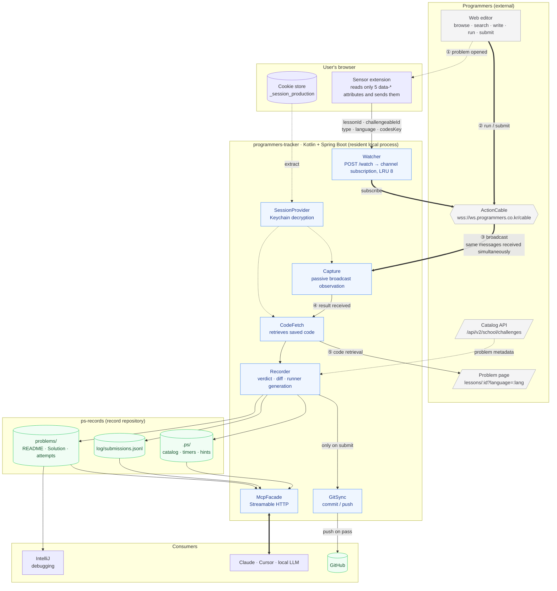
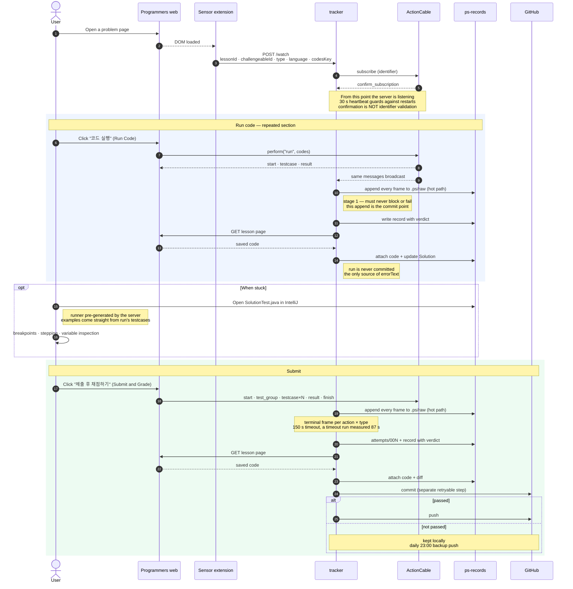
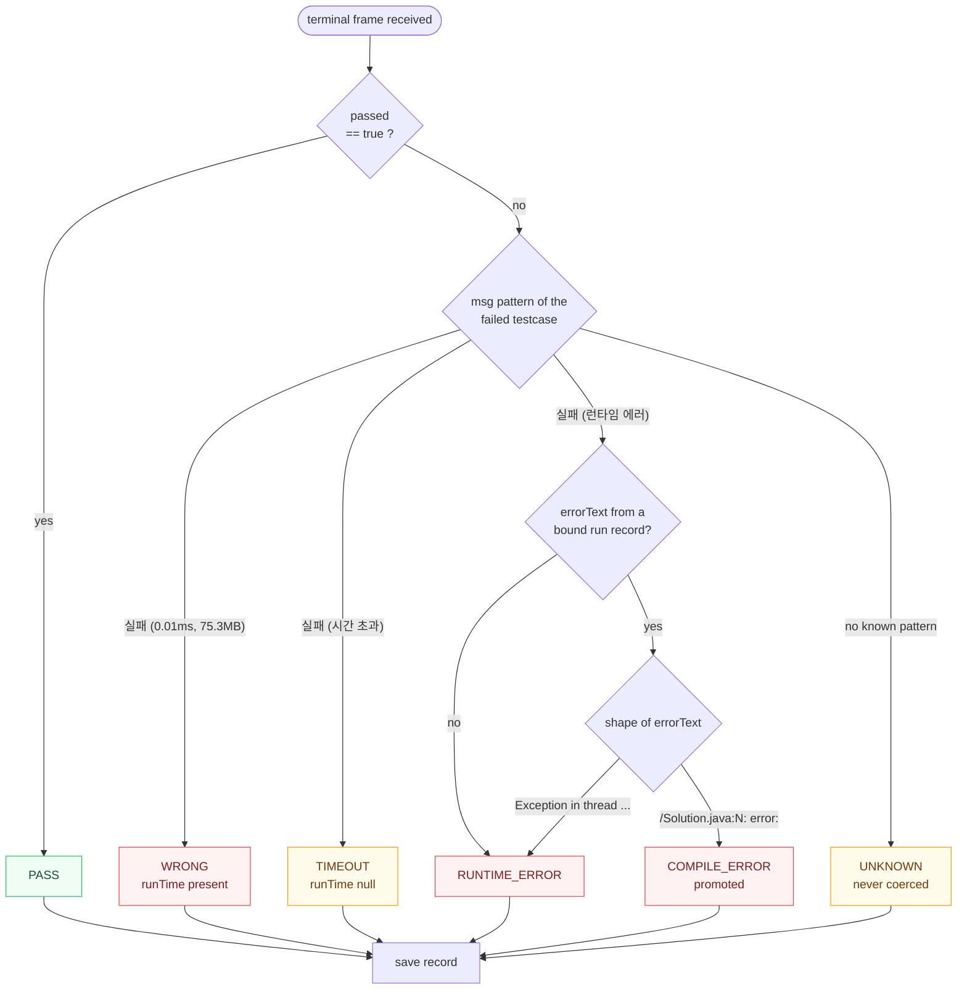

# programmers-tracker Design

Written: 2026-08-04
Status: awaiting design finalization

## 1. Purpose

Record the Programmers solving process **completely, at submission granularity**, and expose
that data over MCP so any AI can provide weakness diagnosis, problem recommendations, and
staged hints.

### Why this is needed

Programmers streams grading results in the moment and then discards them. There is no API to
look up past submissions ([protocol doc](../../programmers-protocol.md) §11). All that
remains is "solved / not solved" and the attempt count per day.

The actual 2025 record reads `attemptTotalCount: 449`, `solvedChallengeCount: 43`.
**Of 449 attempts we can only see the 43 successes; why the other 406 failed is already lost.**

BaekjoonHub also only works on correct answers (`getSolvedResult().includes('정답')`).
It is structurally incapable of recording failure. Once this project is complete, BaekjoonHub
gets removed.

### The judgment that shapes the design

**No analysis logic goes into the server.** The server only collects and aggregates; the
interpretation of "why it was wrong" is done by an AI reading the original code and the diffs
between attempts.

A rule-based analyzer ("3+ timeouts means a time-complexity problem") hits its ceiling fast.
By contrast, when an AI reads the diff between the 1st and 2nd submission it can catch
patterns like "repeatedly misses boundary conditions". The server's mission is to
**leave everything behind, completely, in a form an AI can read.**

## 2. User workflow

The user lives **entirely on the Programmers website.** The server never intervenes.

```
1. Pick and read a problem on Programmers          ← Programmers already does browse/search well
2. Write code in the web editor                    ← no autocomplete = same as the real exam environment
3. Press "코드 실행" (Run Code)                     → the server records the result + code locally
4. When stuck, open the local file in IntelliJ     ← the server has already generated a runner
5. Press "제출 후 채점하기" (Submit and Grade)       → the server records + commits
6. On pass, the server pushes to GitHub
7. Ask an AI "what are my weaknesses?"             → it accesses the data over MCP
```

The server sends **nothing** to Programmers. It subscribes to the same channel and only listens.

## 3. Architecture

### 3.1 System layout



**The bold arrows are the main path of the grading data.** The server sends nothing to
Programmers — it subscribes and listens, and fetches the code from the page.

### 3.2 Capture sequence



**Stage ordering is load-bearing** ([[decisions/2026-08-05-capture-pipeline-stages]]).
The verdict is unrecoverable — Programmers has no submission-history API, so a result not
captured at that moment is lost forever (protocol §11) — while the code can be fetched
again later. Recording therefore never waits on CodeFetch: frames are appended raw as they
arrive, the record is written the moment the session terminates, and code is attached
afterward. A failed CodeFetch leaves `codePending` on an otherwise complete record instead
of discarding a grading result. Git is likewise a separate reconciliation step; a commit
failure never fails a capture ([[decisions/2026-08-05-write-serialization]]).

### 3.3 Verdict classification

The `submit` response alone cannot distinguish a compile error from a runtime error. The key
is consulting the immediately preceding `run` record and promoting the verdict.

**Outcome and verdict are separate dimensions** ([[decisions/2026-08-05-failure-taxonomy]]).
A verdict says the judge reached a conclusion; an outcome says whether we observed one.
Mixing them would let a grading we failed to observe dilute the statistics of gradings we did.

| Outcome | Meaning |
|---|---|
| `JUDGED` | A terminal frame arrived and the message matched a known verdict |
| `INCOMPLETE` | Timeout, disconnect, or eviction before a terminal frame — raw frames kept, record marked partial |
| `UNKNOWN` | Terminal frame arrived but the failure message matches nothing known |

`UNKNOWN` is not hypothetical: a memory-limit-exceeded verdict has never been triggered, so
its `msg` string is unknown (protocol §14). Coercing it into the nearest verdict is exactly
the silent-wrong-data failure the constitution ranks worst. This mirrors `Unknown(type, raw)`
in the protocol layer (development-rules §2.3) one level up.



`errorText` is only obtainable via the `run` path and arrives HTML-escaped
(`<br/>`, `&quot;`, `&#39;`). Unescape it first, then classify by shape.

**The promotion is bound, not merely "previous".** A `run` record qualifies only when it is
the same problem and language **and** its code hash matches the submitted code (or, when no
hash is available, it falls inside a bounded recency window). Without that constraint a run
from forty minutes and ten edits ago would attach its compiler output and promote an
unrelated submit to `COMPILE_ERROR`.

### Why passive observation

ActionCable streams are **scoped by channel parameters**, not by connection. Every client
subscribed to the same `identifier` receives identical messages. We verified empirically that
a separate process, connecting with nothing but the session cookie, received all 4 result
messages fired by the browser as-is (protocol doc §10).

Therefore no MITM proxy and no traffic interception by the extension is needed.

### Why a sensor is needed

The `identifier` must match character-for-character and has no wildcards. There is no way to
subscribe to "all submissions of this user", so the server **must know in advance which
problem the user has opened.** With 689 problems × 13 languages, subscribing to everything is
unrealistic.

## 4. Components

### 4.1 Watcher

Receives `POST /watch` and opens a subscription for that channel.

```jsonc
{ "lessonId": 120804, "challengeableId": 14643,
  "challengeableType": "algorithm", "language": "java", "codesKey": "49598" }
```

- The channel is chosen by `challengeableType`: `algorithm` → `Challenge::AlgorithmChannel`,
  `database` → `Challenge::DatabaseChannel`. Any other value is rejected with an explicit
  error — never guessed.
- Concurrent subscriptions are capped at **LRU 8**, evicted by **last heartbeat**, and a
  subscription with a live grading session is **pinned against eviction**. When every slot is
  pinned, `/watch` fails loudly rather than silently declining to observe
  ([[decisions/2026-08-05-failure-taxonomy]]). Evicting mid-grading would lose a result
  permanently, and "oldest" was previously undefined against a heartbeat that touches every
  open tab every 30 s.
- The extension sends a heartbeat every 30 seconds, so subscriptions recover automatically
  after a server restart. **`/watch` is therefore idempotent**: a repeat for an identifier
  that is already subscribed refreshes recency and does nothing else. Re-subscribing on every
  heartbeat would duplicate records.
- The payload is validated (all five fields present, numeric ids parseable, known
  `challengeableType`), and the endpoint has an explicit error contract. The extension sends
  DOM `data-*` values, which are strings and can vanish when Programmers changes markup —
  identifier extraction failure must surface, never substitute a default (CLAUDE.md).
- Switching the language tab changes `codesKey`, so the extension re-sends.
- **`confirm_subscription` does not validate the identifier.** A wrong `challengeable_id` is
  still confirmed and still runs testcases; the only signal is a generic
  `내부적인 오류가 발생했습니다` much later (protocol §3 — the trap behind four consecutive
  failures during reverse engineering). Identifiers are validated independently of the
  subscription, and that generic error is surfaced as a probable identifier mismatch rather
  than recorded as a judging outcome.
- The endpoint binds to **localhost only and requires a local token**. This process holds a
  live session cookie and can push to GitHub; a container that binds `0.0.0.0` would expose
  that to the whole network.

### 4.2 Capture

Connects over WebSocket to `wss://ws.programmers.co.kr:443/cable` and holds the subscriptions.

- Subprotocol `actioncable-v1-json`
- Headers: `Cookie: _session_production=…`, `Origin: https://school.programmers.co.kr`
- **Every received frame is appended raw before anything else** — stage 1 of
  [[decisions/2026-08-05-capture-pipeline-stages]]. The hot path does no parsing decisions,
  no network calls and no derived writes, because that append is the commit point for data
  that cannot be recovered any other way.
- **Termination is an (action × type) matrix**, not one condition:

  | | `submit` | `run` |
  |---|---|---|
  | `algorithm` | `finish` | `result` |
  | `database` (SQL) | `result_lesson_challenge` | `finish` |

  SQL never sends `finish` **on submit**, so waiting only for `finish` hangs forever — but it
  does send one on `run` (protocol §5–§7). `error` terminates any cell: an identical
  resubmission returns a cached result and then `error` within a second (protocol §13.2), and
  a run error ends the stream at `error` (protocol §7). Treating `error` as non-terminal is
  what previously made "record the error too" unreachable. For algorithm submits
  `result_lesson_challenge` arrives *before* `finish`; the late `finish` is absorbed into the
  same session rather than starting a new one.
- **150-second timeout.** A timeout-verdict grading run measured 87 seconds. Capping at 60
  seconds would cut off a legitimate timeout verdict mid-grade. On firing, the session is
  recorded with outcome `INCOMPLETE` and its raw frames kept — never silently dropped.
- `testcase` messages arrive out of order due to parallel grading. Sort by `testcaseId`
  before saving, and **check completeness** against the expected count from
  `test_group.testcaseIds` / `start.testcase_ids`. Sorting alone assumes every testcase
  arrived; a slow one would otherwise vanish from the summary without a trace.
- **`{"type":"ping"}` drives liveness detection.** It arrives every 3 seconds (protocol §4).
  Absence beyond a bounded multiple means the connection is dead: reconnect with backoff,
  re-subscribe the entire active set, log the gap window loudly, and mark sessions that were
  open at disconnect as `INCOMPLETE`. Anything broadcast during a gap is lost permanently
  (protocol §11), so the gap must be visible rather than inferred later.
- Field naming is camelCase for algorithm (`testcaseId`) and snake_case for SQL
  (`testcase_id`). The parser accepts both.

### 4.3 Session cookie

`_session_production` is HttpOnly and unreadable from JS. The server reads it
**directly from the browser's cookie store.**

- macOS: Chrome `Cookies` SQLite + Keychain decryption. The manual-file provider
  (project-local `.ps/session`) is the mandatory cross-platform fallback, not an optional
  extra (development-rules §9.2)
- A one-time Keychain access permission prompt appears on first use
- **Expiry is one auth state observed at two boundaries.** The original detector —
  `reject_subscription` on subscribe — is an **unmeasured assumption**: the protocol document
  never observed that message. A login redirect on the CodeFetch GET is an equally valid
  expiry signal, and expiry can happen mid-session while a subscription is already open. Both
  boundaries feed one auth state; re-extraction attempts are bounded, and on exhaustion the
  user is told to log in again ([[decisions/2026-08-05-failure-taxonomy]])
- The cookie value lives only in memory — never written to disk or logs

### 4.4 CodeFetch

The broadcast carries no source code. After the record is written, fetch the problem page and
pull out the saved code.

```
GET /learn/courses/30/lessons/{lessonId}?language={lang}   (auth required)
  → <input data-type="code" value="<my saved code>">
```

**CodeFetch is a late attachment, never a precondition** — stage 3 of
[[decisions/2026-08-05-capture-pipeline-stages]]. It has an explicit timeout and bounded
retries; on failure the record persists with `codePending` and is retried later. Responses
that are not the expected page are handled distinctly: a login redirect feeds the auth state
(§4.3), a 429 backs off (Programmers' rate-limit rules are unverified — protocol §14), and a
missing `<input data-type="code">` marks the fetch failed rather than storing an empty string.

> **Accepted race**: code is autosaved while editing (protocol §10), so a fetch that happens
> after the result can return code the user has since edited. The window cannot be closed
> under passive observation, so the stored code is defined as **a snapshot at fetch time**,
> and a hash comparison against the previous fetch at least makes drift detectable.

> **Resolved 2026-08-05 (protocol doc §15.1): `run` does save the code.** Measured on lesson
> 120804 — the saved code was unchanged after editing and changed only after `run` was
> pressed. The CodeMirror fallback (MAIN-world injection) is therefore **not needed**, which
> removes the most invasive part of the sensor extension.
>
> A confirming trial eliminated the time-based-autosave hypothesis: after a second edit the
> saved code stayed unchanged for three idle minutes, and a debounce short enough to explain
> the first trial would have fired in that window. What remains unmeasured is SQL and other
> languages.

### 4.5 Recorder

Verdict classification rules (protocol doc §7):

| verdict | rule |
|---|---|
| `PASS` | `result.passed == true` |
| `WRONG` | failed + `msg` contains a runtime (`실패 (0.01ms, 75.3MB)`) |
| `TIMEOUT` | `msg == "실패 (시간 초과)"` |
| `RUNTIME_ERROR` | `msg == "실패 (런타임 에러)"` |
| `COMPILE_ERROR` | same as above, but **promoted when a bound `run` record returned a full compile-error text** |
| *(no match)* | outcome `UNKNOWN` — never coerced into a neighbouring verdict (§3.3) |

The `submit` response alone cannot distinguish a compile error from a runtime error — both
arrive as `"실패 (런타임 에러)"`. Only the `run` path yields the actual error text, and
`msg` is HTML-escaped, so it needs unescaping plus `<br/>` → `\n` replacement. The promotion
is bound by problem, language and code identity (§3.3), not merely by recency.

**All derived writes are serialized on one confined writer**
([[decisions/2026-08-05-write-serialization]]). Up to 8 subscriptions can complete at once
against one JSONL and one git index, so the Recorder runs inside a single-parallelism
dispatcher while session assembly stays on per-session coroutines — the socket read loop is
never blocked by a write.

**`log/submissions.jsonl` is the single authority for `attempt`.** The counter is restored
from it at startup and allocated inside the writer; `attempts/NNN.*` names are derived from
that number. Deriving it from a directory scan would be both a race and a second source of
truth. Read-modify-write state (`.ps/timers.json`, `.ps/hints.json`) is written temp-then-
atomically-replaced, and readers must tolerate a torn final JSONL line.

**Records carry a capture key** derived from the terminal frame, because Programmers issues
no submission id (protocol §11) and `(lessonId, action, attempt)` is not unique for `run`
(§5.1 — runs keep the previous submit's number). The writer drops duplicates, which a
reconnect re-subscribe or a heartbeat repeat can otherwise produce.

### 4.6 GitSync

- **1 `submit` = 1 commit.** Wrong-answer commits pile up as-is — that *is* the learning
  record. `run` is never committed as its own commit; because `run` does update
  `Solution.java` and the JSONL, **staging is path-scoped** so a submit commit carries what
  it means to carry rather than whatever a run left behind.
- **Git is a separate, retryable reconciliation step, not part of the write path**
  ([[decisions/2026-08-05-write-serialization]]). "Commit whatever is uncommitted" is
  idempotent, so a failure is retried rather than lost. `index.lock` may be held by a process
  that is not ours — IntelliJ, a terminal, an Obsidian git plugin — so contention is expected
  and backed off. **A git failure never fails a capture.**
- **Push timing: when the problem passes.** The whole attempt history of a problem goes up
  at once. Note that `git push` moves the whole branch, so a pass on one problem also pushes
  pending commits for others; "never pushed until solved" describes the trigger, not a
  per-problem scope.
- **Backup trigger**: problems never solved are never pushed, so push un-pushed commits
  daily at 23:00 (Asia/Seoul), plus allow manual runs via MCP `push()`. A missed run (machine
  asleep) is caught up at the next start rather than skipped.
- **The record repository is locked exclusively at startup.** Serializing writes inside one
  process says nothing about a second process, and a Docker container plus a local run is a
  realistic double-writer. A second instance refuses to start rather than corrupting records.

Commit message format:

```
[Lv2] 소수 찾기 — WRONG (12/16, attempt 3)
[Lv2] 소수 찾기 — PASS (16/16, attempt 4, 24m18s)
```

Verdict and attempt count stay readable from `git log` alone.

## 5. Data model

### 5.1 Directory layout

```
ps-records/
├── problems/
│   └── 120804-두-수의-곱-구하기/
│       ├── README.md            my attempt history + a link to the problem
│       ├── Solution.java        latest code per language (updated on every run/submit)
│       ├── SolutionTest.java    server-generated runner — for IntelliJ debugging
│       ├── meta.json            identifiers · level · partTitle · acceptanceRate
│       └── attempts/
│           ├── 001.java  001.json  001.raw.jsonl
│           ├── 002.java  002.json  002.raw.jsonl
│           └── 003.sql   003.json  003.raw.jsonl
├── log/
│   └── submissions.jsonl        append-only; newest line per captureKey is the record
└── .ps/
    ├── raw/                     live session frames, before a session completes
    ├── catalog.json             cached catalog of 689 problems
    ├── timers.json              per-problem start times
    └── hints.json               per-problem hint unlock level
```

`attempts/` is the heart of this design. **The diff between 001 → 002 is precisely "what
was missed".**

**Raw frames move, they do not start here.** While a session is live its problem directory
and attempt number do not exist yet, so frames are appended to
`.ps/raw/<ts>-<lessonId>.jsonl` and the file moves to `attempts/00N.raw.jsonl` once the
session completes ([[decisions/2026-08-05-capture-pipeline-stages]]). `.ps/raw/` is therefore
also the crash-recovery work list: whatever is still there at startup is an unprocessed
session.

**Corrections are appended, not edited.** A record can change after it is durable — today
only stage 3 clearing `codePending` when the code is attached — and the log is append-only
because that is what lets it be the attempt authority and the dedup index (§4.5). So a
correction is **a complete second line carrying the same `captureKey`**, and *the newest line
for a key is the record*, kept in the position the first line held so a late attachment
cannot reorder a problem's history.

The consequence is a contract, not a detail: **the file is not one line per submission.**
Anything reading the JSONL directly — the MCP tools, an Obsidian Dataview query, a script —
must resolve newest-per-key or it will list and count every attached submission twice. In the
server there is exactly one implementation of that rule, `application/RecordHistory`, and
every reader goes through it. Decided in
[[decisions/2026-08-05-code-pending-correction-append]].

**Attempt numbering.** The number comes from `log/submissions.jsonl` (§4.5), never from
scanning `attempts/`. Numbering is per problem and monotonic across languages, so the
sequence reads as the problem's chronological history; the file extension records which
language each attempt used. `diffFromPrev` is computed against **the previous attempt in the
same language** — diffing Java against SQL would be noise, not "what was missed".

**Directory naming** is derived from the lesson id plus a slug of the title, and the lesson
id alone is the identity: if Programmers renames a problem the directory is not renamed, so
history never splits in two.

### How run and submit are handled differently

Both are recorded, but **treated differently.** `run` gets pressed dozens of times while
writing code; treating it like `submit` would meaninglessly inflate commits and attempt
numbers.

| | `run` | `submit` |
|---|---|---|
| recorded in `log/submissions.jsonl` | ✅ | ✅ |
| `Solution.java` updated | ✅ | ✅ |
| `attempts/NNN.*` files created | ✗ | ✅ |
| `attempt` number incremented | ✗ (keeps the previous submit's number) | ✅ |
| git commit | ✗ | ✅ |
| `diffFromPrev` computed | ✗ | ✅ (vs. the previous submit) |

`run` is **the only source of the full error text (`errorText`)**, so it must be recorded.
When `submit` gives only `"실패 (런타임 에러)"`, the compiler output or stack trace survives
in the immediately preceding `run` record. That record is also what the Recorder uses for
the `COMPILE_ERROR` promotion.

The `run` count itself is a metric — **how many times you tried before submitting** shows
carefulness and trial-and-error patterns.

The reference point for `elapsedSec` is **the time the extension first reported the problem**
(`.ps/timers.json`). Re-opening the same problem later does not restart the timer; it
accumulates.

The testcases for `SolutionTest.java` come straight from the `testcases: [{input, output}]`
payload carried in the `run` message's `start`. No need to parse the problem-statement HTML.

### 5.2 Submission record

```jsonc
{
  "ts": "2026-08-04T14:23:01+09:00",
  "lessonId": 120804, "title": "두 수의 곱 구하기",
  "level": 0, "part": "코딩테스트 입문", "acceptanceRate": 91,
  "tags": ["구현"],                      // copied from meta.json · [] if untagged
  "language": "java",
  "action": "submit",                    // submit | run
  "attempt": 2,
  "elapsedSec": 847,                     // since the problem was first observed
  "sincePrevSec": 312,                   // since the previous submission
  "hintLevel": 0,                        // 0 = none seen, 1–4

  "captureKey": "a3f1…",                 // terminal frame · dedup key · correction identity
  "outcome": "JUDGED",                   // JUDGED | INCOMPLETE | UNKNOWN
  "verdict": "TIMEOUT",                  // null unless outcome == JUDGED
  "score": {"user": "0.0", "perfect": "100.0"},
  "testcases": [
    {"id": 154911, "passed": false, "msg": "실패 (시간 초과)",
     "runTime": null, "memorySize": null}
  ],
  "tcSummary": {"total": 16, "passed": 0, "failed": 16, "complete": true},
  "rating": {"old": 1372, "new": 1372, "changed": false},

  "rawPath": "problems/120804-…/attempts/002.raw.jsonl",   // null for a run — see below
  "sensor": {"focusedSec": 612, "sawQuestions": false},    // absent when no sensor was watching
  "codePath": "problems/120804-…/attempts/002.java",
  "codePending": false,                  // true when CodeFetch has not succeeded yet
  "diffFromPrev": "@@ -3,1 +3,1 @@\n-        return num1 * num2;\n+        long r = 0; …",
  "errorText": null                      // full compiler/stack-trace text obtained from run
}
```

Five fields exist because of the 2026-08-05 review:

- **`captureKey`** — Programmers issues no submission id (protocol §11) and
  `(lessonId, action, attempt)` is not unique for `run`, so dedup needs a key of our own.
- **`outcome`** — separates "the judge concluded" from "we observed a conclusion"; `verdict`
  is meaningful only for `JUDGED` (§3.3).
- **`tcSummary.complete`** — records whether the observed testcase count matched the expected
  one, so a partially observed grading can never masquerade as a full one.
- **`rawPath`** — the original frames stay reachable from the record, which is what makes
  re-analysis possible (development-rules §2.4). **Null for a `run`** (amended 2026-08-08,
  ADR `2026-08-08-run-raw-sessions`): a run creates no attempt file, so its frames have no
  home inside the record repository. They are kept outside it, under the tool's own state
  directory, and null says that rather than naming a path that resolves to nothing.
- **`codePending`** — a record whose verdict is durable but whose code attachment has not
  succeeded yet. Consumers must tolerate it.
- **`sensor`** — what the browser saw and the grading stream cannot (added 2026-08-10, ADR
  `2026-08-10-sensor-observations`): `focusedSec`, the time the tab was actually in front,
  and `sawQuestions`, whether the problem's 질문하기 tab was opened. **Absent is normal** —
  no extension, or a watch started by hand — and absent is not zero. `elapsedSec` stays as
  it is; the two answer different questions and both are worth having.

**A record is corrected by appending it again.** When the attachment finally succeeds, the
whole record is written a second time with `codePending` false and `codePath`/`diffFromPrev`
filled in, carrying **the same `captureKey`** — the log is never edited in place (§5.1). So
`captureKey` is not only the dedup key: it is the identity that says *these two lines are one
submission*, and a reader that ignores it sees two.

For SQL problems `score`, `rating` and per-testcase `runTime`/`memorySize` are structurally
absent (protocol §6), so they are null rather than zero — a zero would silently enter
averages.

### 5.3 Problem-type tags — AI tagging

**Programmers does not publish per-problem algorithm tags.** The problem page has no tag
markup, and the breadcrumb is just the same value as `partTitle`. Decomposing the
`partTitle` of all 689 problems:

| nature | count | examples |
|---|---:|---|
| contest · course bundles | 422 (61%) | `2022 KAKAO BLIND RECRUITMENT`, `코딩테스트 입문` |
| `연습문제` — uncategorized | 114 (17%) | — |
| SQL topics | 106 (15%) | `SELECT`, `GROUP BY`, `JOIN` |
| **algorithm type** | **47 (7%)** | `해시`, `DFS/BFS`, `탐욕법`, `힙` |

Only the 47 high-score Kit problems carry an algorithm type. Analyzing weaknesses by
`partTitle` alone means **for 93% of problems there is no answer to "which algorithm am I
weak at".**

Internally a `categories` scheme does exist: `/api/v1/ai/recommended-challenges/recommend`
responses carry `"categories":["자료구조"]`. But that API returns a single recommendation
and repeats the same value on repeated calls, so full collection is impossible.

#### Solution — AI tags, server caches

An AI classifies each problem once and the result is reused permanently — exactly the
"server collects, AI interprets" principle.

**The server does not store the statements.** It never did, and it will not: copying
Programmers' problem text into a records repository is reproducing their content for no
benefit we cannot get otherwise, and their terms refuse it. Classification reads a statement
and keeps only the labels; that is what produced the shipped catalog
([[decisions/2026-08-06-shipped-problem-catalog]]). A record links to the problem instead.

```jsonc
// problems/49189-가장-먼-노드/meta.json
{
  "lessonId": 49189, "challengeableId": 813, "codesKey": {"java": 2458},
  "level": 3, "part": "고득점 Kit", "acceptanceRate": 51,
  "tags": ["그래프", "BFS"],          // AI-tagged
  "taggedBy": "claude-opus-5", "taggedAt": "2026-08-04T15:02:11+09:00",
  "pgCategories": ["자료구조"]        // kept alongside when Programmers happens to leak a value
}
```

#### The tag vocabulary is solved.ac's

We do not invent our own tag scheme. **The solved.ac tags are adopted as the
vocabulary.**

```
세그먼트 트리 · 느리게 갱신되는 세그먼트 트리 · 최소 공통 조상 · 트라이 · 위상 정렬
분할 정복 · 분리 집합 · 배낭 문제 · 매개 변수 탐색 · 조합론 · 누적 합 · 비트마스킹
최소 스패닝 트리 · 강한 연결 요소 · 값/좌표 압축 · 오프라인 쿼리 · 스위핑 …
```

Reasons for adoption:

- **Complete.** A hand-rolled list of 17 was missing KMP, LIS, Fenwick tree, topological
  sort, and combinatorics entirely.
- **Hierarchical.** Parent/child relations like `그래프 이론 > 그래프 탐색 > 너비 우선 탐색`
  are in place, so the aggregation granularity can be chosen freely.
- **Korean-native**, matching the vocabulary of Korean coding-test literature.
- **Zero maintenance burden.**

> Baekjoon Online Judge shut down in May 2026. However, **the solved.ac API is still alive
> and keeps serving the tag vocabulary and hierarchy** (measured 2026-08-04: tag list of
> 180, problem lookup normal). What we need is a classification vocabulary, not a judge, so
> the shutdown does not affect us. Still, it is an external dependency, so **the vocabulary
> is pinned as a snapshot in `src/main/resources/tag-vocab.json`** so tagging and aggregation keep working
> even if solved.ac disappears.

```
GET https://solved.ac/api/v3/tag/list                full vocabulary (229 on 2026-08-06)
```

The Cloudflare challenge blocks the server's plain HTTP client. Vocabulary collection is
done **once in a browser context** to produce the snapshot; afterwards only the local file
is read.

Multiple tags per problem are allowed. Untagged problems keep `tags: []`, and `stats`
aggregation counts them separately as "untagged" — nothing is silently dropped.

Feedback flows in through the MCP tool `tag_problem(lessonId, tags[])`.

### 5.4 Capturing Programmers' own metrics

Programmers also runs its own skill report. We keep it alongside as a cross-check for our
analysis.

```
GET /api/v1/school/challenges/users/       {rank, score, solvedChallengesCount}
GET /api/v2/ai/skill-reports/status        {lastReport, submissionsCount, reportCreatable}
```

Snapshot once a day into `.ps/pg-metrics.jsonl`. The rating/ranking time series becomes a
control group independent of our records.

### 5.5 Obsidian viewing layer

`ps-records` is built to **open directly as an Obsidian vault.** No separate GUI is
developed.

**Rationale**: half of our data is already Markdown. With Obsidian plus the Dataview plugin,
tables, filters, sorting, and aggregation all come for free. A homegrown dashboard would be
one more thing to maintain.

#### Separating source from derived

The JSONL is the **source of truth**; the Markdown is **derived**. The server generates the
Markdown from the JSONL. To keep the duplication from drifting, the split must be by
**who writes the file.**

```
problems/120804-두-수의-곱-구하기/
├── README.md         ← server-generated. Overwritten every time; human edits vanish on the next record
├── notes.md          ← retrospective notes. AI/humans append; the server never touches it
├── Solution.java
├── SolutionTest.java
├── meta.json
└── attempts/
```

**Server-written files and human-written files are never mixed in one file.** Splitting a
file into marker-delimited regions eventually breaks.

#### README.md frontmatter

Structured so Dataview can read it.

```markdown
---
lessonId: 120804
title: 두 수의 곱 구하기
level: 0
part: 코딩테스트 입문
acceptanceRate: 91
tags: [구현]
language: java
verdict: PASS
attempts: 2
runCount: 7
elapsedSec: 847
firstSeen: 2026-08-04
lastSubmit: 2026-08-04
confidence: 0.82
nextReview: 2026-10-03
---

# 두 수의 곱 구하기

#프로그래머스 #Lv0 #구현

## Attempt history
| # | Time | verdict | Score | Elapsed |
|---|---|---|---|---|
| 1 | 14:09 | WRONG | 1.4 | 8m12s |
| 2 | 14:23 | PASS | 100.0 | 14m07s |

## Problem
…
```

Tags are also exposed **as Obsidian tags (`#구현`)**. Type clusters become visible in the
graph view, and `[[…]]` links connect problems sharing a tag.

#### Server-generated dashboard notes

The vault root gets notes containing Dataview queries. Since what is generated is the
**query**, not the data, the notes never need updating as records grow.

````markdown
<!-- _weakness.md -->
## First-submission pass rate by tag
```dataview
TABLE length(rows) AS Problems,
      round(100 * length(filter(rows.attempts, (a) => a = 1)) / length(rows)) AS "First-try pass rate (%)"
FROM "problems"
GROUP BY tags
SORT Problems DESC
```

## Passed but slow
```dataview
TABLE level, tags, maxRunTime AS "Max runtime (ms)"
FROM "problems"
WHERE verdict = "PASS" AND slowFlag = true
SORT maxRunTime DESC
```
````

Notes to generate:

| note | contents |
|---|---|
| `_dashboard.md` | recent submissions · problems in progress · today's stats |
| `_weakness.md` | pass rate by tag · verdict distribution |
| `_review.md` | review queue (sorted by `nextReview`) |
| `_warmup.md` | reactivation diagnosis results — alive / fuzzy / dead |
| `_exam.md` | past-exam set progress |

#### Which repository holds what

**The Obsidian vault is `ps-records`.** The folder the user opens is the record repository.

| | `programmers-tracker` (public) | `ps-records` (personal) |
|---|---|---|
| Markdown generation logic | ✅ `adapter/store` | — |
| Dataview query templates | ✅ bundled as resources | — |
| generated `README.md` · dashboard notes | — | ✅ |
| `.obsidian/` settings | — | ✅ |
| **what gets opened in Obsidian** | — | ✅ |

The server is the *producer* side; `ps-records` is the *viewer* side. Query templates are
bundled into the server, and the server writes the notes into the `ps-records` root — the
user never has to build the Obsidian setup by hand.

`ps-records/.obsidian/` is committed too. When someone else creates their own `ps-records`,
the server generates the initial configuration. The only required plugin is **Dataview.**

```
ps-records/                    ← open this folder as the Obsidian vault
├── .obsidian/                 server-generated on init (enables Dataview)
├── _dashboard.md              server-generated
├── _weakness.md
├── _review.md
├── _warmup.md
├── _exam.md
├── problems/
└── log/submissions.jsonl      ignored by Obsidian, read over MCP
```

> Obsidian is entirely optional. `README.md` renders as-is on GitHub, and the path AIs read
> over MCP is the JSONL, which is unaffected. **Obsidian is an optional viewing layer, not a
> dependency.**

### 5.6 Questions this data can answer

| question | fields used |
|---|---|
| **How** do I usually die (logic error / timeout / slip-up) | `verdict` distribution |
| **First-submission pass rate** — the metric that matters most in real exams | `attempt == 1 && verdict == PASS` |
| Weakness by type | `tags` × `verdict` (not `part` — see 5.3) |
| Time spent vs. difficulty | `elapsedSec` × `level` |
| Hint-dependence trend | `hintLevel` time series |
| **Recurring mistakes** | AI reads `diffFromPrev` |
| Untouched types | compare against the 689-problem catalog |

The last item is already proven: of the current 91 problems, 46 are SQL, and on the
algorithm side **DFS/BFS, greedy, heap, and graph are entirely empty.**

## 6. Analysis features

The server computes metrics and hands them over; interpretation is the AI's job. Each
feature is exposed as an MCP tool.

Priorities: **P1 = immediately useful even with little data**, **P2 = becomes meaningful
after dozens of records.**

### 6.1 Past-exam set mode (P1)

`partTitle` is useless as a weakness axis but **perfect as a company × period axis.**
Programmers' greatest asset lives here — company exam sets preserved as sets.

```
Kakao                                     98 problems / 15 period sets
Programmers' own contests                 42 problems
PCCP · PCCE certification                 28 problems
Summer/Winter Coding                      15 problems
Hyundai Mobis · Dev-Matching · Tipstown   15 problems
                                          ─────────
                                          198 problems
```

Sets keep their real exam composition:

```
2023 KAKAO BLIND RECRUITMENT   7 problems   levels 1/2/2/3/3/3/4
2022 KAKAO BLIND RECRUITMENT   7 problems   levels 1/2/2/2/3/3/3
2018 KAKAO BLIND RECRUITMENT  12 problems   levels 1/1/2/2/2/2/2/2/2/3/3/4
```

A **set-level timer mode** is provided. Starting a set runs an overall timer while
per-problem time is recorded separately. Real-exam failures often come from **time
allocation** rather than skill, and facts like "spent 90 minutes on #3 and never saw #4
and #5" only surface when solving as a set.

`exam_start(partTitle)` / `exam_status()` / `exam_finish()`

### 6.2 Company question-style profiling (P1)

Aggregating the AI-tagging results by company × period reveals **what each company asks.**
Programmers itself does not provide this, and once target companies are decided it directly
sets the study priorities.

```
Tag distribution over Kakao's 98 problems → top types and year-over-year trend
```

`company_profile(company?)`

### 6.3 Reactivation diagnosis (P0 — first)

**Premise**: the user solved 103 Gold problems in 2024 (priority queue averaging Gold II,
segment tree averaging Gold I) but has since had a long gap and forgotten much of it.

This fact breaks the premise of the review queue. Computing from "last pass date" makes
**every past problem instantly overdue**, producing no priorities. A starting point is
needed.

The knowledge is **deactivated, not lost**, so recovery is far faster than first-time
learning. It is therefore more efficient to **measure how much was forgotten first** than
to solve new problems.

#### Procedure

1. Pick 1–2 representative previously-passed problems per tag (based on
   `.ps/tag-vocab.json`)
2. The server **backs up the existing code**, then resets the Programmers editor
3. The user re-solves without looking at the code — timer running
4. Compare the result against the past record and classify three ways

```
Alive   passed on the 1st try · elapsed time within 1.5× of the past record
Fuzzy   2–3 attempts, or 2×+ elapsed time, or hint level 1–2
Dead    4+ attempts · hint level 3+ · did not pass
```

This map becomes **the actual study priority list.** Pass rate by tag alone cannot separate
"never tried" from "did it but forgot", and those two call for entirely different
prescriptions.

#### Editor reset

Opening a solved problem on Programmers shows the old code, so it cannot simply be
re-solved. The `reset` action restores the initial skeleton.

```js
channel.perform("reset")   →   handleReset { initialCodes }
```

> **Warning**: `reset` erases the code saved on Programmers. Run it only after the server
> has secured a backup under `problems/<problem>/attempts/`. Resetting without a backup
> loses the past solution irrecoverably. It is an unverified action, so implementation must
> confirm it empirically.

`warmup_plan(perTag?)` / `warmup_reset(lessonId)` / `warmup_report()`

### 6.4 Review queue (P1)

"Re-solving old problems" is in substance **spaced repetition**, not similarity search.
Programmers only knows "solved"; we know **how** it was solved.

```
confidence = f(attempt count, hint level, elapsed time, performance vs. expectation)
next review date = last pass date + g(confidence)

  1st try, no hints, 10 min          → high confidence → 60 days later
  5 wrong tries, level-3 hints       → low confidence  → 3 days later
```

All of it is exact computation; no vector search required. `review_queue(limit?)`

### 6.5 Passed-but-slow queue (P1)

`run_time` arrives per testcase. **Passing is not the end.** A pass that is markedly slower
than same-tag/same-level problems signals missing the intended solution.

Existing records already catch it:

| problem | runtime | likely cause |
|---|---:|---|
| 더 맵게 (Lv2) | 1636.97 ms | priority-queue problem, presumably re-sorting every iteration |
| 전화번호 목록 (Lv2) | 371.72 ms | hash problem, presumably sort + compare |

With efficiency tests in a real exam, this is an outright fail. `slow_passes(threshold?)`

### 6.6 Performance vs. expectation (P2)

The catalog's `acceptanceRate` corrects for difficulty. Solving a 91%-acceptance problem in
5 tries and a 4%-acceptance problem in 2 tries are completely different achievements, yet
both are recorded merely as `PASS`.

```
expected attempts ≈ f(acceptanceRate, level)
performance = expected attempts / actual attempts        > 1 means above expectation
```

A far more precise axis than `level` 1–5, and reused as-is for difficulty control in
problem recommendation.

### 6.7 Tracking failed testcase numbers (P2)

Programmers does not disclose testcase contents but **does reveal which numbers failed.**
Tracking the intersection across submissions turns that into information.

```
1st: 3,7,9,12,14 fail   →   2nd: 9,14   →   3rd: 14
```

The number that survives to the end is a specific edge case. Asking an AI "only #14 keeps
failing — what counterexample is this?" makes it inferable. Invisible in a single
submission; only visible once history accumulates.

`stuck_testcases(lessonId)`

### 6.8 Language-choice experiment (P2)

Whether to take the real exam in Java or Kotlin is a genuine decision. Kotlin is shorter
and saves time, but unfamiliarity breeds mistakes. Comparing **first-submission pass rate
and elapsed time per language** within the same level band answers it with data. Only our
records can tell.

`stats(groupBy: "language")`

### 6.9 Auto-generated retrospective notes (P1)

The moment a problem passes, an AI reads the problem's **entire attempt history and diffs**
and appends a one-paragraph summary to `README.md`.

> Missed the `n=1` boundary in attempt 1; attempt 2 timed out, so switched to `HashMap`.
> Passed on attempt 3. Recurring pattern: boundary values not checked first.

Combined with the review queue, **you read your past self before re-solving.**
The server only provides the hook; the AI generates the summary.
`append_retro(lessonId, text)`

### 6.10 Concept prerequisites (P2)

The real cause of "weak at DP" may be the recursion/brute-force that precedes it. A fixed
graph layering learning order onto the solved.ac tag hierarchy lives in
`.ps/concept-graph.json`.

```
완전탐색 → 재귀 → 다이나믹 프로그래밍
정렬 → 이분 탐색 → 매개 변수 탐색
그래프 탐색 → 최단 경로 → 데이크스트라
```

Fixed data with a few dozen nodes — no graph DB needed.

### 6.11 What was rejected — vector DB

At the current scale (689 problems, under 2,000 expected submissions) the full embedding
set is around 4 MB and exact search finishes in milliseconds. There is no reason to
sacrifice accuracy for approximate nearest-neighbor search.

More fundamentally, **coding-test problems deliberately decouple surface narrative from
actual type.** "택배 상자 싣기" and "회의실 배정" read nothing alike yet are both
greedy+sorting; "미로 탈출" and "미로 만들기" read alike yet differ in type. **Statement
embeddings point in exactly the wrong direction.** AI tagging is the more accurate
similarity axis.

All the text we keep — my code, my errors, my diffs — is preserved, so an index can be
built later if ever needed. Problem statements are **not** among it and are not ours to
index. Vectors become genuinely necessary only when merging
external problem banks into tens of thousands of items, or when hundreds of natural-language
retrospectives require semantic search.

## 7. MCP interface

Transport is **Streamable HTTP**. stdio is one-per-process, which does not fit a resident
server. A thin bridge is shipped alongside for stdio-only clients.

```
[Query]
  list_problems(level?, part?, tag?, status?)  catalog of 689 problems
  get_problem(lessonId)                        my attempts, with a link to the problem
  submissions(since?, verdict?, tag?)          submission history
  attempt_diff(lessonId, from, to)             diff between attempts
  stats(groupBy)                               aggregation by verdict · tag · language

[Reactivation]  ← 6.3 · the first tools to use
  warmup_plan(perTag?)                         pick re-check targets per tag   P0
  warmup_reset(lessonId)                       back up code, then reset editor P0
  warmup_report()                              alive / fuzzy / dead            P0

[Analysis]  ← §6
  review_queue(limit?)                         review queue        6.4  P1
  slow_passes(threshold?)                      passed but slow     6.5  P1
  performance(lessonId?)                       vs. expectation     6.6  P2
  stuck_testcases(lessonId)                    stuck case numbers  6.7  P2
  company_profile(company?)                    company tendencies  6.2  P1

[Exam mode]  ← 6.1
  exam_start(partTitle)                        start the set timer
  exam_status()                                remaining problems · elapsed
  exam_finish()                                results + time-allocation report

[Write]
  tag_problem(lessonId, tags[])                AI tagging feedback  5.3
  untagged(limit?)                             list untagged problems
  append_retro(lessonId, text)                 append retro note    6.9
  mark_hint(lessonId, level)                   record hint unlock
  push()                                       GitHub sync

[Resources]
  ps://problem/{lessonId}
  ps://submissions/recent
  ps://stats/weakness
  ps://exam/current
```

**Every analysis tool returns only numbers and raw data.** The "why" interpretation is done
by the AI.

`stats` emits numbers only. Interpretation is done by an AI reading `attempt_diff` and the
original code.

### Hint unlock rules

Four levels, and **the next level opens only after at least one submission since the
previous level.**

1. Approach direction only
2. Name of the data structure / algorithm to use
3. Pseudocode
4. Full solution

Recorded via `mark_hint`; "how far the hints went" is itself a skill indicator.
The server manages only the level state; hint content is generated by the AI.

## 8. Sensor extension

It has one job — **announce "this problem is being viewed right now."** It touches neither
code nor results, and knows nothing about GitHub.

```js
// content script: school.programmers.co.kr/learn/courses/30/lessons/*
const el = document.querySelector("[data-challengeable-id]");
const input = document.querySelector("input[data-type=code]");

const notify = () => fetch("http://localhost:8080/watch", {
  method: "POST",
  headers: {"Content-Type": "application/json"},
  body: JSON.stringify({
    lessonId:          document.querySelector("[data-lesson-id]").dataset.lessonId,
    challengeableId:   el.dataset.challengeableId,
    challengeableType: el.dataset.challengeableType,
    language:          input.dataset.language,
    codesKey:          input.id,
  }),
});

notify();
setInterval(notify, 30_000);   // heartbeat — survives server restarts
```

Its only permissions are access to `school.programmers.co.kr` pages and localhost requests.

## 9. Edge cases

| situation | handling |
|---|---|
| submitting while the server is down | Missed, permanently. The solved-list diff detects only that *something* passed — never fabricate a record from it (see below) |
| running immediately after opening the page | Subscription completed in 0.43 s when measured (protocol §10). The risk is the returning-tab and restart windows, not typing speed |
| back-to-back submissions of the same problem | Programmers serves a cached response then emits `error` (protocol §13.2). `error` is a terminal frame, so the session ends and is recorded with outcome `UNKNOWN` |
| several problems open at once | up to 8 concurrent subscriptions, evicted by last heartbeat, active sessions pinned (§4.1) |
| switching the language tab | `codesKey` changes → extension re-notifies; `/watch` is idempotent |
| cookie expiry | one auth state observed at both the subscribe and CodeFetch boundaries (§4.3) |
| connection drops mid-grading | ping absence detects it; reconnect + re-subscribe; open sessions become `INCOMPLETE` and the gap is logged (§4.2) |
| grading never terminates | 150 s timeout → `INCOMPLETE` with raw frames kept (§4.2) |
| a second server instance starts | refused — the record repository is locked exclusively (§4.6) |
| problems never passed | daily 23:00 backup push + manual `push()` |

**On "partial recovery": the solved list is a detector, not a source.** It reveals that a
problem became solved while we were not listening, and nothing else — no code, no verdict, no
attempt, no timestamp. Synthesizing a record from it would inject a fabricated PASS with a
fabricated time into every metric that depends on first-try rate, elapsed time and review
scheduling. The gap is therefore surfaced to the user as a known blind spot, and no record is
written. Recording nothing is bad; recording something wrong is worse (CLAUDE.md).

## 10. Test strategy

- **Judge/Capture**: integration tests against real Programmers. Reproduce all 5 verdicts
  on Lv0 problems (PASS / WRONG / TIMEOUT / RUNTIME_ERROR / COMPILE_ERROR).
  The verification log in protocol doc §15 is the basis for expected values.
- **Recorder**: pin captured real message streams as fixtures and unit-test.
  Cover both algorithm and SQL formats.
- **GitSync**: unit tests against a temporary repository.
- **MCP**: contract tests per tool.

## 11. Implementation order

1. **Reproduce subscribe/receive with a Kotlin WebSocket client** — the only unverified
   assumption. Confirmed only with Python, so break this first.
2. Cookie extraction (Chrome Cookies SQLite + Keychain)
3. Capture + verdict classification + verifying whether code is saved on `run`
4. Recorder — directories · JSONL · diff · runner generation
5. Watcher + sensor extension
6. GitSync
7. MCP exposure
8. Remove BaekjoonHub

With just 1–4, records already start accumulating. **The order maximizes how early data
accumulation begins.**

## 12. Finalized decisions

| item | decision |
|---|---|
| stack | Kotlin + Spring Boot |
| grading integration | passive observation (ActionCable subscription) |
| where code is written | the Programmers web editor |
| debugging | the user, directly in IntelliJ. **No debugger MCP** |
| hints | 4-level unlock; must submit to open the next level |
| record repository | `ps-records` — personal data, private |
| server source | `programmers-tracker` — to be public |
| commits | 1 per `submit` (`run` is not committed) |
| push | on problem pass + daily 23:00 backup |
| cookie | auto-extracted from the browser store |

### Why no debugger MCP

With the [Debugger MCP Server](https://plugins.jetbrains.com/plugin/29233-debugger-mcp-server)
it is technically possible for an AI to drive breakpoints, stepping, and variable
inspection. But the reason for wanting debugging was "I want to set the breakpoints
myself." If an AI drives the debugger, debugging is outsourced rather than learned, which
**directly contradicts the decision to turn autocomplete off.**

Not an irreversible decision — if needed later, it can be attached as a separate MCP
server.

## 13. Open questions · assumptions

- **Identical behavior in Kotlin** — verified only with Python. Confirm in implementation
  step 1.
- **Whether code is auto-saved on `run`** — unverified. On failure, the extension sends the
  CodeMirror value along.
- The 2-entry `scores` shape for problems with efficiency tests — never triggered
- A memory-limit-exceeded verdict — never triggered
- The exact rules of Programmers' rate limiting — unconfirmed
- Breakage risk on Programmers UI/API changes. Identifier extraction depends on `data-*`
  attributes and is fragile to markup changes. On failure, emit a clear error and never
  silently record wrong data.
